# Ch6 — 目标检测

## 6.1 目标检测原理概述

### 6.1.1 目标检测要解决什么问题？

在一张日常生活中的图片——比如街景照片。你一眼扫过去，能看到车、行人、交通灯、路牌……你的大脑不仅识别出了这些物体是什么，还精确地知道它们在画面中的哪个位置。

让计算机做到同样的事，就是目标检测要做的事情。用更正式的语言来说：**目标检测（Object Detection）同时解决两个问题——分类（这是什么？）和定位（它在哪里？）**。

具体来说，把一张图像 $I$ 输入模型，模型需要输出一组检测结果，每组结果包含三条信息：

- **类别标签 $c_i$**：这个目标是什么（车？人？狗？）
- **边界框 $b_i$**：目标在图像中的精确位置，通常用 $(x, y, w, h)$ 表示中心坐标和宽高，或者用 $(x_1, y_1, x_2, y_2)$ 表示左上角和右下角坐标
- **置信度 $s_i$**：模型对这个检测结果有多"确信"，一个 0 到 1 之间的分数

### 6.1.2 目标检测和图像分类有什么不同？

很多同学可能先接触过图像分类。图像分类只需要回答"这张图里是什么"这一个问题，输出的结果是整张图的一个类别标签。比如输入一张猫的照片，输出"猫"。

目标检测要难得多——一张图里可能有多个目标，你需要：

1. **找出所有目标的位置**（不能漏掉任何一个）
2. **对每个目标正确分类**（不能把狗认成猫）
3. **同一个目标不能重复检测**（每个目标只应该有一个框）

拿图像分类和目标检测做个对比，差距一目了然：

| | 图像分类 | 目标检测 |
|---|---|---|
| 输入 | 一张图像 | 一张图像 |
| 输出 | 一个类别标签 | 多个 (类别 + 位置 + 置信度) |
| 一张图检测几个目标 | 1 个 | 不限 |
| 知道目标在哪吗？ | 不知道 | 知道（精确到像素的边界框） |
| 典型场景 | 猫狗识别 | 自动驾驶、安防监控 |

### 6.1.3 两种主流检测范式

既然目标检测要做这么多事，那从架构上怎么设计呢？深度学习时代发展出了两大流派。

**Two-Stage（两阶段检测）**

两阶段方法的思想很直观——与其在一整张图上大海捞针，不如先找出"可能有东西"的区域，再对这些区域仔细判断。

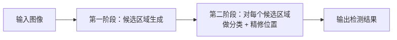

- **第一阶段**：生成大约几百到几千个"候选框"，把图像中最有可能包含目标的区域框出来。这就像你扫一眼照片，先注意到"那边有个东西"
- **第二阶段**：对每个候选框，仔细做两件事——判断它属于哪个类别（分类），以及修正它的边界让它更精确地包围目标（回归）

代表方法：Faster R-CNN 系列。它的优势是精度高——因为第二阶段筛掉了大量不是目标的背景，正负样本比例可控。代价是速度慢一些，毕竟分两步走。

**One-Stage（单阶段检测）**

单阶段方法更"直接"——不先生成候选框，而是一步到位，从图像像素直接回归出所有目标的类别和位置。

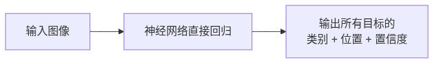

- 没有中间的候选区域生成步骤
- 输入图像 → 卷积网络 → 直接输出 N 个检测框

代表方法：YOLO 系列。优势是速度快（适合实时场景），但早期版本在精度上略逊于两阶段方法。不过后面的发展让两者的边界越来越模糊——最新的单阶段方法在精度上完全不输两阶段。


> **核心理解**：Two-Stage 是"先扫一眼找到可能位置，再仔细看"；One-Stage 是"一眼看完直接报答案"。选择哪个取决于你的场景——需要极致精度选 Two-Stage，需要实时速度选 One-Stage。但近年来这俩的界限越来越模糊了。

### 6.1.4 这个领域到底难在哪里？

目标检测发展到今天，看似模型已经很强了，但这些核心挑战仍然存在：

| 核心挑战         | 具体表现/难点描述                                            |
| :--------------- | :----------------------------------------------------------- |
| **尺度变化**     | • 同一类目标大小差异巨大 <br />• 小目标可能仅占几个像素 <br />• 大目标可能占满整个画面 |
| **遮挡问题**     | • 目标之间互相遮挡 <br />• 部分关键特征不可见 <br />• 模型需要“脑补”缺失信息以完成识别 |
| **小目标检测**   | • 有效信息量太少<br /> • 特征难以有效提取<br />• 被认为是目前最困难的方向之一 |
| **密集场景**     | • 目标扎堆出现 <br />• 边界框（Bounding Box）高度重叠<br /> • 容易导致漏检或重复检测 |
| **速度精度平衡** | • 实时应用如自动驾驶要求 30+ FPS <br />• 高精度模型通常计算量大、速度慢 <br />• 需要在速度与精度之间寻找最优解 |
| **背景干扰**     | • 背景包含复杂纹理和颜色<br /> • 相似物体容易产生误检<br /> • 需要模型具备更强的语义理解能力 |

这些挑战也正好解释了为什么目标检测的方法一直在迭代——**每一个新的网络结构、每一个新的损失函数，几乎都是为了解决上面某一个或某几个具体问题而诞生的**。理解了挑战，才能理解后面的各种设计选择。

---

## 6.2 核心评价指标

在深入学习具体的检测方法之前，得先搞清楚"怎么评价一个模型做得好不好"。目标检测的评价比分类复杂得多——你不仅要看分类对不对，还要看定位准不准。

### 6.2.1 IoU —— 模型和正确答案有多"重叠"？

IoU（Intersection over Union，交并比）是目标检测中最基础、最核心的度量。它衡量的是**两个框的重叠程度**——预测框和真实框"撞"了多少。

$$\text{IoU} = \frac{|A \cap B|}{|A \cup B|}$$

公式含义：IoU = 两个框的交集面积 ÷ 两个框的并集面积。用图来理解：

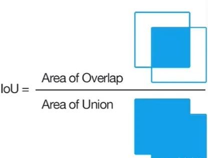

几种典型情况：

- IoU = 1：两个框完全重叠，预测完美无瑕
- IoU ≈ 0.7~0.9：预测很不错，框的位置比较精准
- IoU ≈ 0.5：勉强可以接受的检测，但位置偏差明显
- IoU = 0：预测框和真实框完全不沾边

在实际使用中，我们需要设定一个 IoU 阈值（通常取 0.5）来判断一个预测算不算"正确"。如果预测框与某个真实框的 IoU ≥ 0.5 **且**类别预测正确，那这个预测就算命中目标。

> IoU 看起来简单，但它不仅用来评价结果好坏，还被直接用作损失函数的设计基础（后面 6.4 节会详细讲）。**IoU 唯一的"盲区"是它只看重叠面积，不关心框的中心在哪、形状匹不匹配**。这直接催生了后来的 GIoU、DIoU、CIoU 等改进版本。

### 6.2.2  Precision 与 Recall—— 你的模型有多少"对的"检测？

光说"这个框对不对"还不够，我们还需要从全局角度评价模型的检测质量。这里引入四个基本概念：

**TP、FP、FN、TN 到底是什么？**

先来拆解这四个字母的含义：

- **T / F**（True / False）：判断对了还是判断错了
- **P / N**（Positive / Negative）：模型给出的预测是"有目标"还是"没目标"

两两组合就得到了四个概念：

| 概念 | 全称 | 通俗理解 |
|---|---|---|
| TP (True Positive) | 真阳性 | 判断对了，模型说有目标，实际确实有目标——**检测对了** |
| FP (False Positive) | 假阳性 | 判断错了，模型说有目标，但实际没有——**误检（虚警）** |
| FN (False Negative) | 假阴性 | 判断错了，模型说没目标，但实际有——**漏检** |
| TN (True Negative) | 真阴性 | 判断对了，模型说没目标，实际也确实没有——对了但不太重要 |

这四个概念初看有点绕，我们用两个例子来彻底搞懂——先从一个简单的分类场景开始，再回到目标检测。

**例子一：班级里的"找女生"（分类场景）**

这个例子帮你建立最直观的理解。已知：班级共 100 人，其中男生 80 人，女生 20 人。目标是把所有女生找出来（女生 = 正类）。

现在某个"模型"选出了 50 个人，声称这些都是女生。逐一核实后发现：

- 20 个真正的女生被成功找了出来 → **TP = 20**
- 30 个男生被错误地当成了女生 → **FP = 30**
- 0 个女生被漏掉（所有女生都在选出的 50 人中）→ **FN = 0**
- 50 个男生没有被选出来，他们也确实是男生 → **TN = 50**

> 注意：TN 在这个例子里是 50，但在公式中一般不出现。因为"正确的拒绝"太多了，统计它没有意义。

有了 TP、FP、FN，就可以计算两个核心指标了：

$$\text{Precision} = \frac{TP}{TP + FP} = \frac{20}{20 + 30} = 0.4$$

Precision 回答的问题是：**模型说"是女生"的人里，真正是女生的比例有多大？** 它衡量的是模型会不会"乱报"。

$$\text{Recall} = \frac{TP}{TP + FN} = \frac{20}{20 + 0} = 1.0$$

Recall 回答的问题是：**所有真正是女生的人里，模型成功找出了多少？** 它衡量的是模型会不会"漏掉"。

在这个例子里，Recall 完美（一个没漏），但 Precision 只有 0.4（选出来的 50 人里混了 30 个男生）。模型太"激进"了——宁可错杀也不放过。

**例子二：街景中的"找人"（检测场景）**

现在回到目标检测的语境。一张图中实际有 10 个人。模型检测出了 8 个框。逐一核对：

- 6 个框正确框住了人（TP = 6）
- 2 个框框在了错误的物体上，比如把垃圾桶认成了人（FP = 2）
- 剩下的 4 个人模型根本没检测到（FN = 4，因为 10 - 6 = 4）

套用同样的公式：

$$\text{Precision} = \frac{6}{6 + 2} = 0.75,\quad \text{Recall} = \frac{6}{6 + 4} = 0.6$$

> **从分类到检测，TP/FP/FN 的含义没变，但场景变了**。分类场景中每个样本是一个独立个体（学生），检测场景中每个样本是一个预测框。核心逻辑完全一样——"判断对了没有" × "模型说了什么"。


> **Precision 和 Recall 是天生的冤家**——你把检测门槛设高（只出置信度最高的框），Precision 很高但 Recall 很低（漏了一堆目标）；你把门槛设低（什么框都输出），Recall 很高但 Precision 很差（误报满天飞）。一个好的检测器就是要在两者之间找到最优平衡。

### 6.2.3 从 Precision 和 Recall 到 AP

但光说 Precision 高或者 Recall 高还不够——你调整一下置信度阈值，Precision 和 Recall 都会跟着变。我们想要一个**综合了所有可能阈值情况**的单一指标。这就是 AP（Average Precision）的来源。

AP 衡量的是某一个类别在**所有可能的 Recall 水平下**的整体 Precision 表现。下面用五个步骤把计算过程彻底拆解清楚。

**步骤 1：收集某一类别的所有预测框**

对某个类别（比如"人"），把模型输出的所有预测框收集起来。每个框带两个信息：它的置信度（模型觉得它有多靠谱），以及它和哪个真实框匹配上了（IoU 是否超过阈值、类别是否一致——是不是 TP）。

**步骤 2：按置信度降序排序**

把所有预测框按置信度从高到低排好。置信度最高的排第一个，最低的排最后。为什么从高往低排？因为实际使用时，我们会按照置信度来决定"展示哪些结果给用户"——展示越多的框（把阈值调低），Recall 就越高，但 Precision 会下降。

**步骤 3：逐个累加，计算 Precision 和 Recall**

从置信度最高的框开始，一个一个往结果集中加。每加一个框，更新当前的累计 TP 和 FP，算出当前的 Precision 和 Recall。这样得到一系列 $(Recall, Precision)$ 点——每个点对应"把置信度阈值设到这里为止"时的表现。

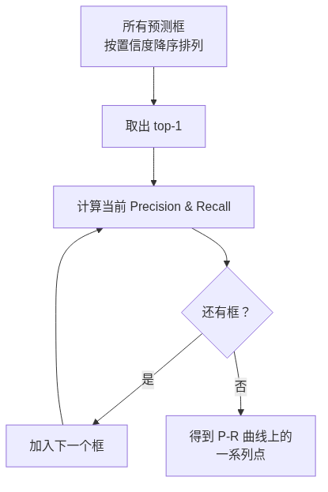

**步骤 4：构建 P-R 曲线并插值平滑**

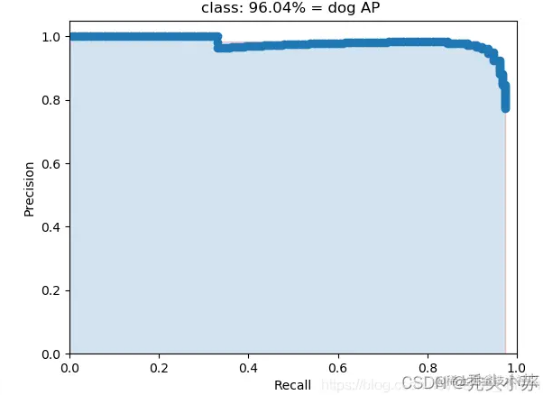

将上面得到的点绘制成 P-R 曲线。随着 Recall 增加，Precision 总体呈下降趋势——因为越来越多的低置信度框被加入，其中错误的可能性也越来越大。曲线可能不是单调下降的（会有波动），所以通常会对 Precision 做**插值平滑**——在每个 Recall 水平上，取它"右边所有 Precision 的最大值"作为平滑后的值：

$$p_{\text{interp}}(r) = \max_{\tilde{r} \geq r} p(\tilde{r})$$

**步骤 5：计算 AP**

AP 就是平滑后的 P-R 曲线下方的面积。关于怎么算这个"面积"，有两种主流方法：

- **VOC 2007 方式**：在 Recall 0 到 1 之间均匀取 11 个点（0, 0.1, 0.2, ..., 1.0），在每个点上取插值后的 Precision 值，11 个值取平均：

  $$\text{AP} = \frac{1}{11} \sum_{r \in \{0, 0.1, ..., 1.0\}} p_{\text{interp}}(r)$$

- **VOC 2010 及 COCO 方式**：对整个 Recall 范围上的 P-R 曲线做积分（即曲线下面积），比 11 点法更精准：

  $$\text{AP} = \int_0^1 p_{\text{interp}}(r) \, dr$$

> AP 的强大之处在于：**它用一个数字同时衡量了漏检（低 Recall 时 Precision 也低）和误检（高 Recall 时 Precision 掉得多）**，而且不受置信度阈值选择的干扰。

### 6.2.4 mAP —— 多类别下的终极指标

实际任务中通常不只检测一个类别（比如 COCO 数据集有 80 个类）。**mAP（mean Average Precision）就是把所有类的 AP 取个平均**：

$$\text{mAP} = \frac{1}{C} \sum_{c=1}^{C} \text{AP}_c$$

它是目标检测领域最核心、最通用的评价指标。

**COCO 评价体系**是目前业界使用最广的标准，它考核得很细致：

| 指标名 | 含义 |
|---|---|
| AP@[0.5:0.95] | IoU 阈值从 0.5 到 0.95，步长 0.05，共 10 个阈值下的 mAP 取平均。这是**最核心**的指标 |
| AP@0.50 | 只取 IoU ≥ 0.5 就算对（VOC 传统标准，相对宽松） |
| AP@0.75 | IoU ≥ 0.75 才算对（对定位精度要求更高） |

> **为什么 mAP 能成为行业标准？** 因为它一个指标同时衡量了**分类对不对、定位准不准、有没有漏检、会不会误检、在不同类别上表现是否均衡**。五个维度，一个数字，简洁有力。

### 6.2.5 别忘了速度

在实际落地中，光精度高是不够的。自动驾驶需要实时处理视频流（≥ 30 FPS），移动端应用需要模型小到能跑在手机上。所以通常还会关注：

- **FPS（Frames Per Second）**：每秒能处理多少张图，衡量推理速度
- **FLOPs（浮点运算次数）**：模型跑一次要多少计算量，和硬件要求直接相关
- **参数量（Params）**：模型有多少参数，影响内存占用和部署可行性

---

## 6.3 核心组件与技术

了解了"怎么评价"之后，我们来看看目标检测系统内部的几个关键组件。这些组件就像乐高积木，不同模型用不同的方式组合它们。理解了这些零件，再看各种模型的设计就会觉得顺理成章。

### 6.3.1 Anchor —— 给模型一个"先验"

想象一下，你要教一个初学者怎么画边界框。你不会让他从一张白纸开始随便画，而是会给他一些参考——"大概在这个位置，大概是这个比例"。

**Anchor（锚框）就是给网络提供的这种"参考"**。它在特征图的每个位置上预先放置一组固定大小和比例的框，网络不需要从零开始预测坐标，只需要在这些锚框的基础上做"微调"。

**为什么需要锚框？** 因为直接预测绝对坐标（比如"这个框的中心在 (342, 567)，宽 203，高 411"）是非常困难的——数值范围太大，网络不好学习。但如果有一个参考锚框，网络只需要学习"在锚框基础上向左偏 10%，高度增加 20%"，这种相对偏移就稳定多了。

以 Faster R-CNN 为例，它在每个特征图位置上生成 9 个锚框：3 种尺度（128²、256²、512²）× 3 种宽高比（1:1、1:2、2:1）。

YOLOv2 更进一步——它觉得人工设计的锚框尺寸未必最适合当前数据集，于是用 **K-means 聚类**在训练集的所有标注框上自动找出最典型的几种尺寸。聚类的距离度量也很聪明，用的是 $d = 1 - \text{IoU}$——两个框越不重叠，距离越远。语义上就是：我们关心的是"框长得像不像"，而不是"框的坐标差多少"。

**那锚框有什么缺点？**

说实话锚框挺"麻烦"的：
- 你需要精心设计锚框的尺寸和比例（超参数调优地狱）
- 每个位置生成一堆锚框，大部分都是背景（正负样本极度不平衡）
- 对于特别大或特别小的目标，预设的锚框可能覆盖不到

这些缺点正好推动了 **Anchor-Free 方法**的兴起（我们会在 6.6 和 6.7 节详细讨论）。核心思想就是——扔掉锚框，直接让网络自己去想怎么定位。

### 6.3.2 NMS —— 消除"一物多框"

检测器有个毛病——对同一个目标，它经常输出好几个高度重叠的预测框（每个都认为自己是最准的）。这其实不难理解：特征图上相邻的几个位置可能都"看到"了同一个物体。

**NMS（Non-Maximum Suppression，非极大值抑制）的任务就是：从这些重复的框中，只保留最好的那个。**

算法步骤其实很简单：

1. 把当前所有预测框按置信度从高到低排好序
2. 取出最高置信度的框（一定保留它，因为它最有把握），把它放进结果列表
3. 计算剩下所有框与这个"冠军框"的 IoU。如果 IoU > 阈值（常见 0.5），说明它们检测到的是同一个目标——删掉
4. 对剩余的框，重复步骤 2-3，直到没有框剩下
5. 结果列表里就是最终保留的所有框

用代码实现起来非常直观：

```python
import numpy as np


def nms(boxes, scores, iou_threshold=0.5):
    """
    NMS（非极大值抑制）

    参数:
        boxes:   ndarray, shape (N, 4), 预测框坐标 (x1, y1, x2, y2)
        scores:  ndarray, shape (N,),   每个框的置信度
        iou_threshold: float, IoU 阈值, 超过此值视为"同一目标"

    返回:
        keep: list[int], 保留下来的框的索引
    """
    # 1. 计算每个框的面积（用于 IoU 计算）
    x1 = boxes[:, 0]
    y1 = boxes[:, 1]
    x2 = boxes[:, 2]
    y2 = boxes[:, 3]
    areas = (x2 - x1) * (y2 - y1)

    # 2. 按置信度从高到低排序
    order = np.argsort(scores)[::-1]

    keep = []
    while order.size > 0:
        # 3. 取出当前最高置信度的框，直接保留
        best_idx = order[0]
        keep.append(best_idx)

        if order.size == 1:
            break

        # 4. 计算"冠军框"与其余框的 IoU
        xx1 = np.maximum(x1[best_idx], x1[order[1:]])
        yy1 = np.maximum(y1[best_idx], y1[order[1:]])
        xx2 = np.minimum(x2[best_idx], x2[order[1:]])
        yy2 = np.minimum(y2[best_idx], y2[order[1:]])

        # 交集宽高（不相交时为负，clamp 到 0）
        inter_w = np.maximum(0.0, xx2 - xx1)
        inter_h = np.maximum(0.0, yy2 - yy1)
        inter = inter_w * inter_h

        # IoU = 交集 / 并集
        union = areas[best_idx] + areas[order[1:]] - inter
        iou = inter / union

        # 5. IoU > 阈值的框视为检测到同一目标，删掉
        remain = np.where(iou <= iou_threshold)[0]
        order = order[remain + 1]  # +1 是因为 order[1:] 的索引偏移

    return keep
```

关键细节解释：

- `np.argsort(scores)[::-1]` 按置信度**降序**排列，保证每次先处理最有把握的框
- `order[remain + 1]` 里的 `+1` 是因为 `order[1:]` 比原 `order` 少了第一个元素（冠军框已取出），索引需要补偿
- IoU 计算中的 `np.maximum(0.0, ...)` 确保不相交的框不会出现负面积

**Soft-NMS：当两个目标真的离得很近时**

标准 NMS 有一个致命问题：如果两个同类目标挨得很近（比如马路上一排紧挨着的车），其中一个的预测框可能和另一个目标的框 IoU 太高，被误删了。

Soft-NMS 的解决方案很优雅——不直接删，而是**降低这些框的置信度**：

$$s_i = s_i \cdot e^{-\frac{\text{IoU}(M, b_i)^2}{\sigma}}$$

如果一个框和冠军框 IoU 越高，它的置信度就被降得越厉害。但不会直接归零，所以如果它其实是附近另一个真正的目标，它仍然有机会在后面的迭代中胜出。

### 6.3.3 数据增强 —— 用"变体"扩充训练集

一张图，稍微改一改，对人类来说还是同一张图，但对模型来说就是一个全新的训练样本。**数据增强就是利用这一点，通过对训练图像做各种随机变换，凭空"造"出更多训练数据。**

为什么要这么做？因为真实场景中光照、角度、尺度千变万化，而标注数据永远不够多。数据增强让模型见过更多"变体"，泛化能力自然更好。

**常用的数据增强方法**：

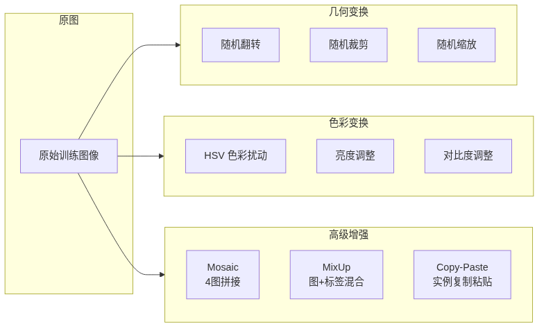

特别要提一下 **Mosaic 增强**（YOLOv4 引入）——它把 4 张不同的训练图片随机缩放后拼成一张大图。这样做有几个好处：拼出来的图片中包含更多的小目标（因为被缩小了），上下文也更丰富（一张图里有 4 种场景）。这是 YOLO 系列最经典的数据增强手段之一。

以下参数在yolo模型训练中可以调整这些设置以满足数据集和当前任务的具体要求。尝试不同的值有助于找到能带来最佳模型性能的最优增强策略。

| 参数                                                         | 描述                                                         | 图例                                                         |
| :----------------------------------------------------------- | :----------------------------------------------------------- | ------------------------------------------------------------ |
| [`hsv_h`](https://docs.ultralytics.com/zh/guides/yolo-data-augmentation#hue-adjustment-hsv_h) | 按色相环的一小部分调整图像的色相，引入颜色变异性。有助于模型在不同的光照条件下进行泛化。 | 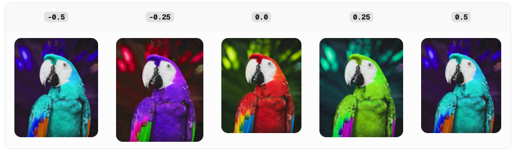                 |
| [`hsv_s`](https://docs.ultralytics.com/zh/guides/yolo-data-augmentation#saturation-adjustment-hsv_s) | 按一小部分改变图像的饱和度，从而影响颜色的强度。有助于模拟不同的环境条件。 | 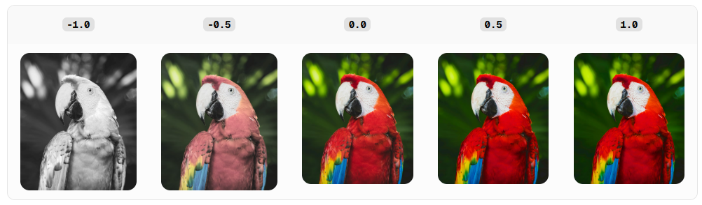 |
| [`hsv_v`](https://docs.ultralytics.com/zh/guides/yolo-data-augmentation#brightness-adjustment-hsv_v) | 按一小部分修改图像的值（亮度），帮助模型在各种光照条件下良好运行。 | 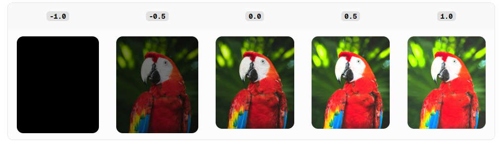 |
| [`degrees`](https://docs.ultralytics.com/zh/guides/yolo-data-augmentation#rotation-degrees) | 在指定的角度范围内随机旋转图像，提高模型识别不同方向物体的能力。 | 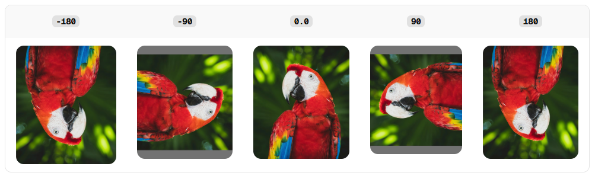 |
| [`translate`](https://docs.ultralytics.com/zh/guides/yolo-data-augmentation#translation-translate) | 按图像大小的一小部分水平和垂直平移图像，有助于学习检测部分可见的物体。 | 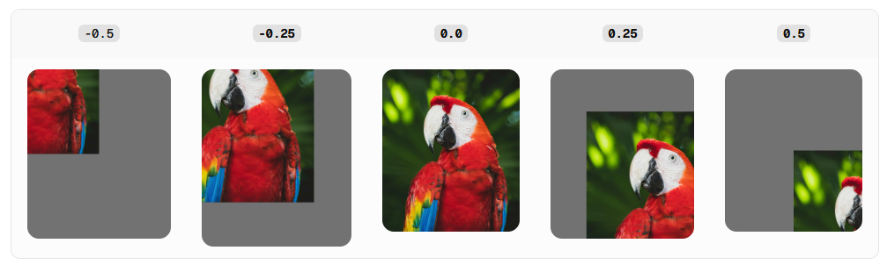 |
| [`scale`](https://docs.ultralytics.com/zh/guides/yolo-data-augmentation#scale-scale) | 通过增益因子缩放图像，模拟相机视角中距离不同的物体。         | 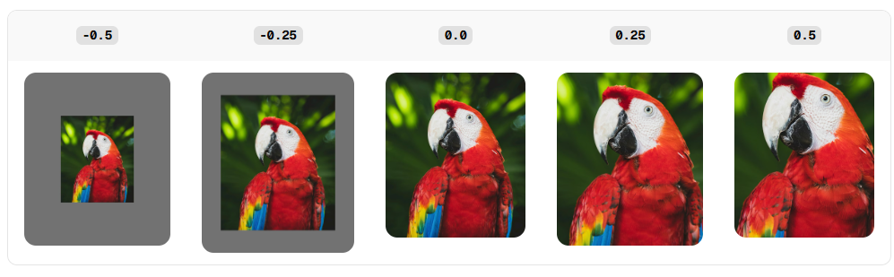 |
| [`perspective`](https://docs.ultralytics.com/zh/guides/yolo-data-augmentation#perspective-perspective) | 对图像应用随机透视变换，增强模型理解 3D 空间中物体的能力。   | 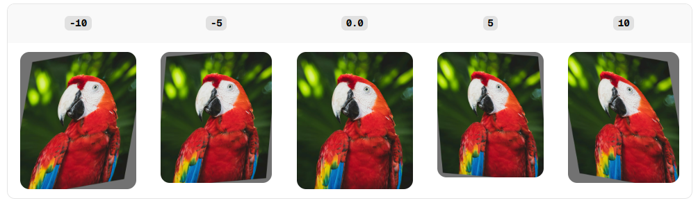 |
| [`flipud`](https://docs.ultralytics.com/zh/guides/yolo-data-augmentation#flip-up-down-flipud) | 以指定的概率将图像上下翻转，在不影响物体特征的情况下增加数据变异性。 | 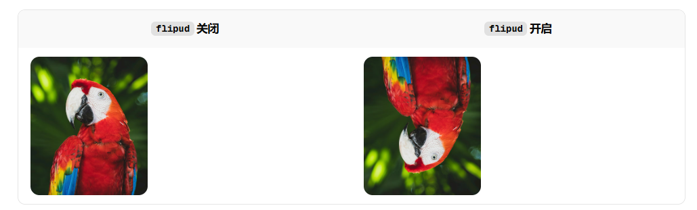 |
| [`fliplr`](https://docs.ultralytics.com/zh/guides/yolo-data-augmentation#flip-left-right-fliplr) | 以指定的概率将图像左右翻转，这对于学习对称物体和增加数据集多样性非常有用。 | 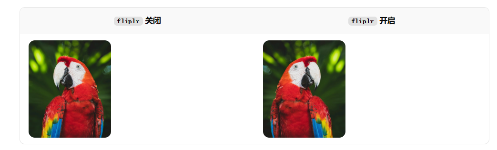 |
| [`bgr`](https://docs.ultralytics.com/zh/guides/yolo-data-augmentation#bgr-channel-swap-bgr) | 以指定的概率将图像通道从 RGB 翻转为 BGR，这对于提高对通道顺序错误的稳健性非常有用。 | 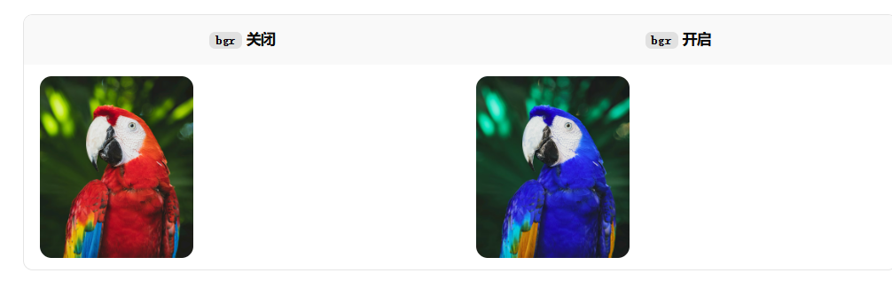 |
| [`mosaic`](https://docs.ultralytics.com/zh/guides/yolo-data-augmentation#mosaic-mosaic) | 将四张训练图像合并为一张，模拟不同的场景构图和目标交互。对于复杂场景理解非常有效。 | 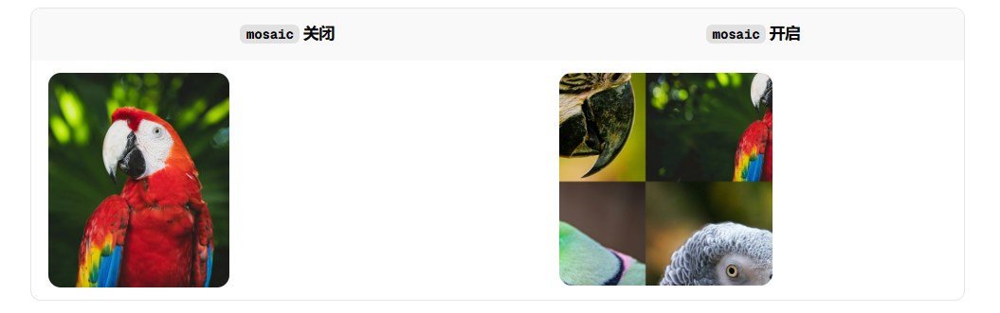 |
| [`mixup`](https://docs.ultralytics.com/zh/guides/yolo-data-augmentation#mixup-mixup) | 混合两张图像及其标签，创建一个合成图像。通过引入标签噪声和视觉多变性，增强模型的泛化能力。 | 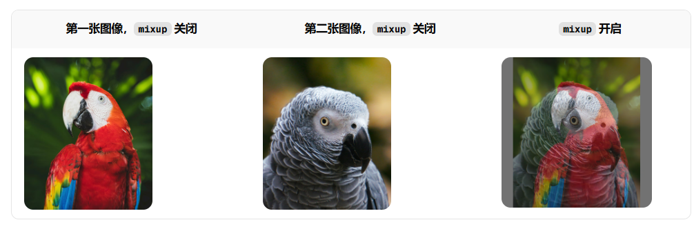 |
| [`cutmix`](https://docs.ultralytics.com/zh/guides/yolo-data-augmentation#cutmix-cutmix) | 结合两张图像的部分内容，在保持不同区域的同时创建部分混合。通过创建遮挡场景增强模型的鲁棒性。 | 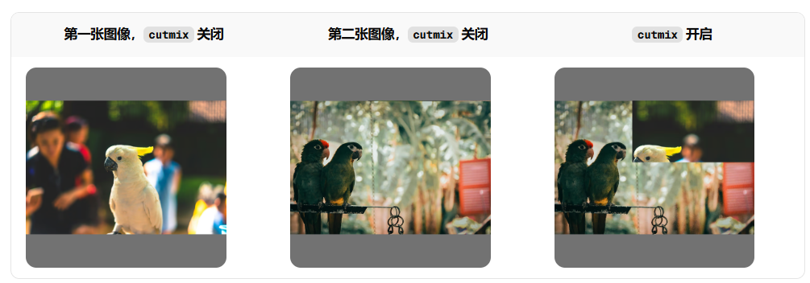 |

### 6.3.4 Label Smoothing —— 别让模型太"自信"

分类模型通常用 One-Hot 标签训练：正确的类别标为 1，其他全标为 0。比如"这是一只猫" → [0, 1, 0, 0, 0]。

这种硬标签有个潜台词：**模型被要求对正确答案百分百确信**。但现实中，有些图片本身就是模糊的、模棱两可的。强制模型输出极端概率会导致两个问题：一是过拟合（模型认为自己的判断永远是"绝无错误"的），二是泛化差（遇到没见过的东西时过于武断）。

**Label Smoothing 的做法是"软化"标签**：

$$\tilde{y}_i = (1 - \epsilon) \cdot y_i + \frac{\epsilon}{K}$$

其中 $\epsilon$ 是平滑因子（常见 0.1），$K$ 是类别数。比如原来的 One-Hot 标签 [0, 1, 0, 0, 0]（共 5 类，$\epsilon=0.1$）变成：[0.02, 0.92, 0.02, 0.02, 0.02]——正确类别只给 0.92 的确信度，其余每个类给 0.02 的"小概率"。

这样做让模型学到的不是一个"绝对的是非判断"，而是一个**更平滑、更宽容的概率分布**。结果就是模型对训练集不那么"偏执"，在测试集上表现更稳健。

不过 Label Smoothing 也有局限：它本质上是在给标签加均匀分布的随机噪声，并不能反映类别之间真实的关系（猫和狗确实比猫和汽车更相似，但 Label Smoothing 对所有非正确类一视同仁）。在知识蒸馏场景中，使用 Label Smoothing 训练的教师网络质量反而更差。

---

## 6.4 Bounding Box 回归损失函数

你可能已经注意到了——目标检测的很多设计难题都围绕一个核心问题：**怎么让预测框更精准地靠近真实框？** 这个"靠近"的度量方式，就体现在回归损失函数的设计上。

边界框回归损失函数是目标检测中演进脉络最清晰的部分，每一代的改进都直指前代的痛点。发展路径如下：

$$\text{Smooth L1} \;\rightarrow\; \text{IoU Loss} \;\rightarrow\; \text{GIoU} \;\rightarrow\; \text{DIoU} \;\rightarrow\; \text{CIoU}$$

下面我们一个一个来看，重点是理解**每个版本解决了什么问题，又留下了什么问题**。

### 6.4.1 Smooth L1 Loss —— 第一代回归损失

Faster R-CNN 用的是 Smooth L1 Loss，它在 L1 和 L2 之间取了个折中：

$$L_{\text{smoothL1}}(x) = \begin{cases} 0.5x^2 & \text{if } |x| < 1 \\ |x| - 0.5 & \text{otherwise} \end{cases}$$

解释一下这个分段设计：当预测值和真实值差距不大时（$|x| < 1$），用 L2（平方）损失，梯度随误差减小而减小，收敛精细又稳定；当差距很大时，切换到 L1（绝对值）损失，梯度恒定，不会被大误差带偏。这个设计在工程实践上很聪明。

**但它有一个根本性的问题**：Smooth L1 把边界框的四个坐标（$x, y, w, h$）当成四个独立的变量，分别算损失再加起来。可实际上这四个坐标不是独立的——$x$ 的误差对 IoU 的影响和 $y$ 的误差完全不同。结果是：两个预测框可能有同样的 Smooth L1 损失值，但实际的 IoU 天差地别。**损失函数的优化目标和最终的评价指标（IoU）脱节了**。

### 6.4.2 IoU Loss —— 直接优化"正主"

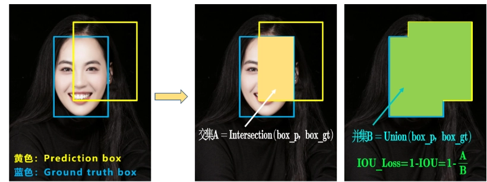

那为什么不用 IoU 本身作为损失函数呢？IoU Loss 就是这么想的：

$$L_{\text{IoU}} = 1 - \text{IoU}(B_p, B_g) = 1 - \frac{|B_p \cap B_g|}{|B_p \cup B_g|}$$

优点明显：**优化什么就评价什么**，损失值直接反映了定位质量。

但 IoU Loss 有两个硬伤，一个比一个严重：

**硬伤一：预测框和真实框完全不相交时，怎么办？**

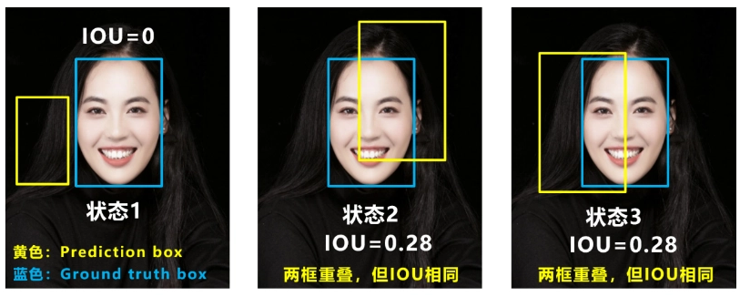

此时 IoU = 0，$L_{\text{IoU}} = 1$，是一个常数。常数意味着梯度为零——模型不知道应该让预测框往哪个方向移动才能靠近真实框。在训练初期，预测框很可能和真实框完全不沾边，优化直接卡死。

**硬伤二：相同 IoU 值的预测框，位置可能完全不同。**

比如下面三种情况，每一对的 IoU 都一样，但你肯定能看出它们的对齐质量完全不同：

- 情况 A：预测框偏左，有些区域重叠
- 情况 B：预测框偏右，相同程度重叠
- 情况 C：预测框在目标框正中间偏上

IoU 值相同，IoU Loss 完全无法区分这三种情况。这对精确定位来说是一个很大的盲区。

### 6.4.3 GIoU Loss —— 用"最小闭包"解决不相交问题

GIoU（Generalized IoU）通过引入**最小闭包矩形**来弥补 IoU 的缺陷。什么是最小闭包矩形？就是同时包含预测框和真实框的最小矩形。

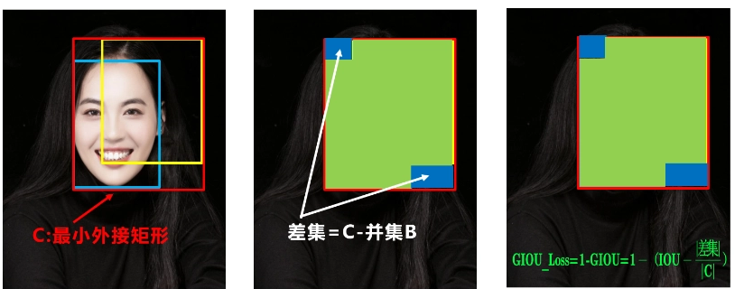

$$L_{\text{GIoU}} = 1 - \text{IoU} + \frac{|C - (B_p \cup B_g)|}{|C|}$$

其中 $C$ 是那个最小闭包矩形。公式的后半部分可以理解为：**最小闭包中不属于两个框的部分越大，惩罚就越大**。

你现在看出 GIoU 的聪明之处了吗？当预测框和真实框不相交时，虽然 IoU = 0，但两个框离得越远，最小闭包 $C$ 就越大，惩罚项就越大——**不相交情况下也有了可优化的梯度**。模型知道应该让框往哪个方向靠拢了。

但 GIoU 仍然有一个问题没有解决：**当预测框完全被真实框包含时**（或者反过来），此时 $C = B_p \cup B_g = B_g$​，惩罚项退化为 0，GIoU 直接退化成 IoU，无法区分"框在中心"和"框在角落"。

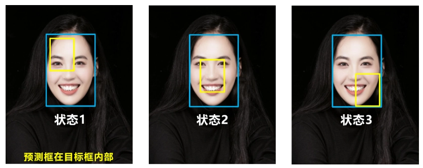

### 6.4.4 DIoU Loss —— 让中心点直接靠近

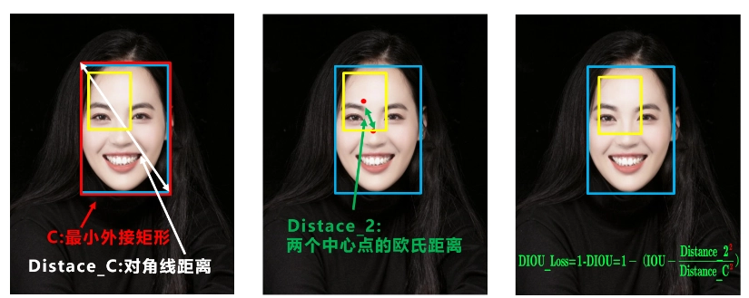

DIoU（Distance IoU）的改进直击要害——**既然中心点距离很重要，那就直接在损失里加上它**：

$$L_{\text{DIoU}} = 1 - \text{IoU} + \frac{\rho^2(b_p, b_g)}{c^2}$$

其中 $\rho(b_p, b_g)$ 是两框中心点的欧氏距离，$c$ 是最小闭包矩形的对角线长度。

这个设计带来了三个好处：
- **收敛更快**：中心距离直接拉到损失里，优化路径更直接

- **完全包含也不怕**：即使预测框在真实框内部，中心点距离仍然能衡量"偏离了多少"，GIoU 退化的问题不复存在

- **优化行为更合理**：训练时预测框会自然地朝真实框中心靠拢

  

- 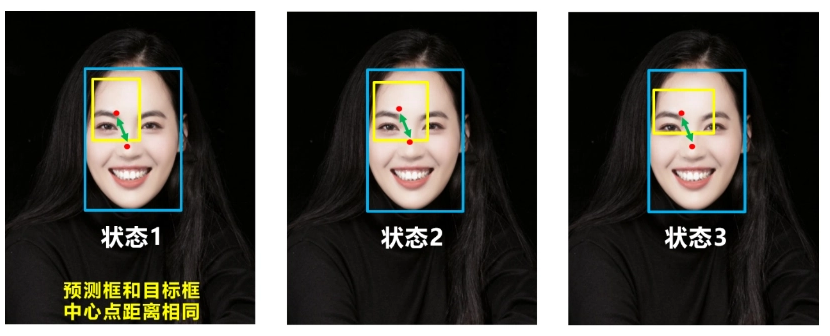

### 6.4.5 CIoU Loss —— 把宽高比也考虑进来

DIoU 还差最后一块拼图——**两个框可能中心重叠，但形状不同**（一个正方形、一个长条形）。它们应该有不同分数，但 DIoU 无法区分。

CIoU（Complete IoU）把宽高比也加进了损失函数，做到了当时的最完整建模：

$$L_{\text{CIoU}} = 1 - \text{IoU} + \frac{\rho^2(b_p, b_g)}{c^2} + \alpha v$$

其中宽高比惩罚项 $v$ 和平衡权重 $\alpha$ 为：

$$v = \frac{4}{\pi^2}\left(\arctan\frac{w_g}{h_g} - \arctan\frac{w_p}{h_p}\right)^2, \quad \alpha = \frac{v}{(1 - \text{IoU}) + v}$$

$v$ 用 $\arctan$ 来比较宽高比（因为 $\arctan$ 在宽高差异很大时也不会爆炸），$\alpha$ 是一个自适应权重——当 IoU 较小时，让宽高比的影响弱一些，优先把框的位置和大小对齐。

### 6.4.6 综合对比

把五个损失函数放在一起看，演进逻辑一目了然：

每个版本增加的维度：

| 损失函数 | 重叠面积 | 中心距离 | 宽高比 | 不相交可优化 |
|---|---|---|---|---|
| Smooth L1 | ✗ | ✗ | ✗ | ✓ |
| IoU Loss | ✓ | ✗ | ✗ | ✗ |
| GIoU Loss | ✓ | ✗ (间接) | ✗ | ✓ |
| DIoU Loss | ✓ | ✓ | ✗ | ✓ |
| CIoU Loss | ✓ | ✓ | ✓ | ✓ |

> **演进规律**：每一步都在损失中编码一个额外的几何维度——重叠面积 → 最小闭包 → 中心距离 → 宽高比。最终 CIoU 在这四个维度上做到了全覆盖，也成了今天几乎每款 YOLO 版本的标准配置。

---

## 6.5 Two-Stage 检测器：Faster R-CNN 原理详解

Faster R-CNN 是两阶段检测器的集大成者，2015 年发布至今仍被广泛使用和改进。理解它不仅是为了使用它，更是因为**它定义了目标检测的许多基础概念**——anchor、RPN、ROI Pooling、端到端训练——这些概念深刻影响了后续几乎所有检测器的设计。

### 6.5.1 前传：为什么需要两阶段？

在 Faster R-CNN 出现之前，目标检测的流程是这样的：

**R-CNN（2014）** 是第一个把 CNN 引入目标检测的工作。思路很直接：

1. 用 Selective Search 算法在原图上生成大概 2000 个候选框
2. 把每个候选框从原图上裁下来，缩放到统一尺寸（227×227）
3. 把 2000 个裁剪图逐个送进 CNN（比如 AlexNet）提取特征
4. 用 SVM 分类器对每个特征向量做分类
5. 用线性回归器对框的位置做微调

每一步思路都很清晰，但实战中慢得让人绝望——**2000 个候选框意味着 2000 次 CNN 前向传播**。而且训练是分步走的（先训 CNN、再训 SVM、再训回归器），整个流程不优雅。

**Fast R-CNN（2015）** 的关键改进一句话就说明白了：**整张图只过一次 CNN，所有候选框共享这张特征图**。这就像你用 Google Maps 提前加载了整个区域的卫星图，每个具体地点只需要在上面标位置就行，不用每次都重新加载。Fast R-CNN 还引入了 ROI Pooling（后面会细讲），把不同大小的候选框统一映射为固定尺寸的特征向量，方便后面接全连接层。


但 Fast R-CNN 还留了一个尾巴——**候选框仍然是用 Selective Search 这种外部算法生成的**，不是神经网络自己产生的。

### 6.5.2 Faster R-CNN 的核心思路


Faster R-CNN 的突破就是把这个"尾巴"也砍掉了——**用 RPN（Region Proposal Network，区域提议网络）替代 Selective Search，让生成候选框的过程也由神经网络完成**。至此，整个目标检测流程首次实现了完全的端到端。

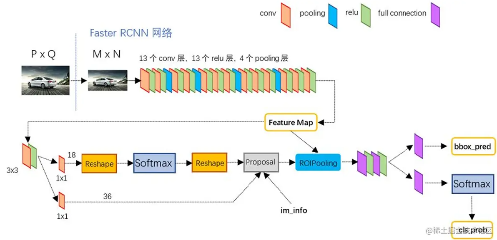

Faster R-CNN 的完整流程如下：


可以看到，Faster R-CNN 实际上就是 **RPN（候选框生成）+ Fast R-CNN（候选框分类+回归）**，两者共享同一个 Backbone 的特征图。

### 6.5.3 Backbone —— 特征提取基底

Backbone 是整条流水线的基础，负责把原始图像转化成多层次的语义特征。Faster R-CNN 论文使用的是 **VGG16**——一个在当时效果不错、结构又比较规整的网络。

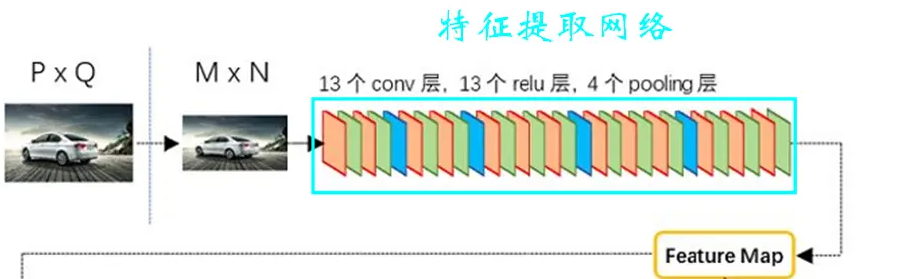

以 VGG16 为例来分析 Backbone 做了什么：
- 13 个卷积层，卷积核全是 3×3，padding = 1（卷积后特征图大小不变）
- 4 个池化层（Max Pooling 2×2, stride = 2），每次池化特征图尺寸减半
- VGG16 原始有 5 个池化层，但 Faster R-CNN **丢弃了最后一个**——否则特征图会被下采样 32 倍，过于粗糙

所以一张 $M \times N$ 的图片经过 Backbone 后，特征图的大小变为 $\frac{M}{16} \times \frac{N}{16}$。比如输入 800×600，特征图就是 50×38。

需要强调的是——Backbone 是**可替换**的。后来大家普遍改用 ResNet（残差网络，训练更稳定）、FPN（特征金字塔，多尺度更好）等作为 Backbone。RPN + Detection Head 的设计与具体 Backbone 解耦，这也是 Faster R-CNN 框架灵活性的体现。

### 6.5.4 RPN —— 网络自己学会"看哪里"

RPN 是 Faster R-CNN 的灵魂。它的工作原理可以这样理解：

在共享特征图上，用一个 3×3 的窗口滑过每个位置。对于每个位置，RPN 要做两件事——**判断这里是不是"可能有东西"（分类），以及可能是什么样的框（回归）**。

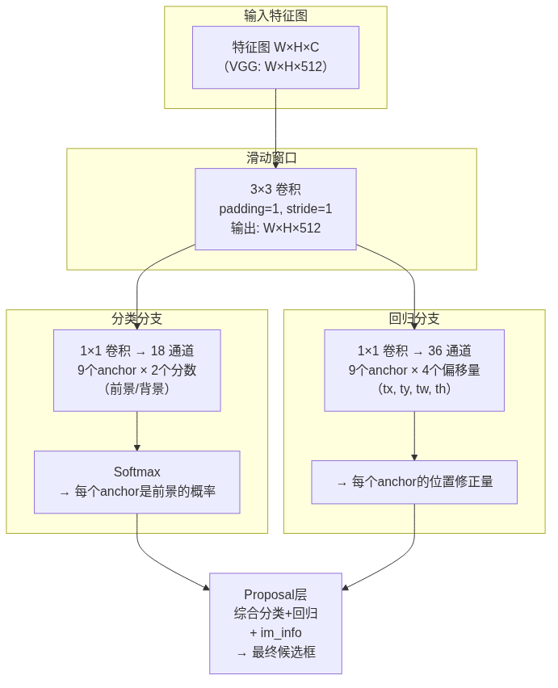

两个分支的作用很明确：

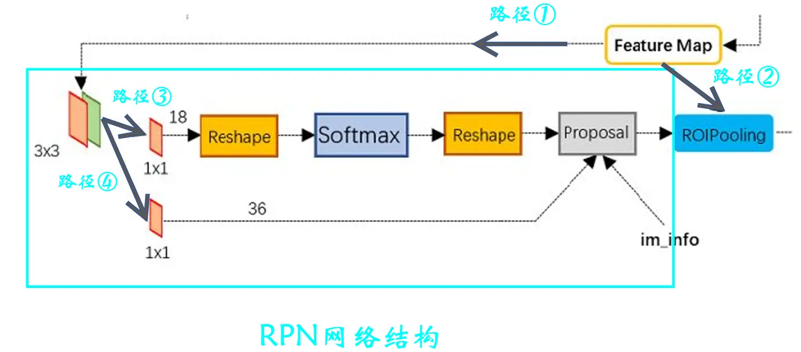

- **分类分支**：对 9 个 anchor 分别打分，判断它是"前景"（包含真实目标）还是"背景"（啥也不是）。为什么是 18 个通道？因为 9 个 anchor × 2 个类别（前景和背景）= 18
- **回归分支**：对 9 个 anchor 分别输出 4 个微调参数 ($t_x, t_y, t_w, t_h$)，告诉每个 anchor 应该如何调整自己才能更贴近真实目标。为什么是 36 个通道？因为 9 个 anchor × 4 个偏移量 = 36

**特征图上的一个点对应原图的哪个位置？** 这是一个关键问题。因为 Backbone 做了 4 次 2× 池化，总下采样倍数是 16。所以特征图上坐标 $(x_{feat}, y_{feat})$ 对应原图的中心点为 $(16 \times x_{feat}, 16 \times y_{feat})$。在这个原图位置上，画出 9 个 anchor——它们就是 RPN 后续处理的基本单元。

**什么算正样本？什么算负样本？**

训练 RPN 时，并不是所有 anchor 都参与训练：
- **正样本**：和某个真实框 IoU 最大的 anchor，或者和任何一个真实框 IoU > 0.7 的 anchor（绝大多数情况满足后者）
- **负样本**：和所有真实框的 IoU 都 < 0.3 的 anchor
- IoU 在 0.3~0.7 之间的 anchor **直接忽略**，不参与计算损失

> RPN 的设计哲学是"分而治之"——分类分支专做前景/背景判断，回归分支专做位置修正，最后在 Proposal 层汇合，组合出高质量的候选框。

### 6.5.5 RPN 的损失函数

RPN 的损失也由两部分组成，和它的两个输出分支对应：

$$L(\{p_i\}, \{t_i\}) = \frac{1}{N_{cls}} \sum_i L_{cls}(p_i, p_i^*) + \lambda \frac{1}{N_{reg}} \sum_i p_i^* \cdot L_{reg}(t_i, t_i^*)$$

拆开来看：
- $L_{cls}$：二分类交叉熵损失，判断每个 anchor 是前景还是背景
- $L_{reg}$：Smooth L1 损失，**只对正样本计算**（因为 $p_i^* = 1$ 时回归才有意义——你让模型对一个全是背景的 anchor 回归位置就离谱了）
- $p_i^*$：真实标签（1 表示该 anchor 是正样本，0 表示负样本）
- $\lambda$：平衡系数，让两类损失的数值量级相仿

**怎么把 anchor 变成最终的预测框？** RPN 输出的是偏移量 $(t_x, t_y, t_w, t_h)$，需要解码到绝对坐标。编码方式（以 anchor $(x_a, y_a, w_a, h_a)$ 为基准）：

$$t_x = \frac{x - x_a}{w_a}, \quad t_y = \frac{y - y_a}{h_a}, \quad t_w = \log\frac{w}{w_a}, \quad t_h = \log\frac{h}{h_a}$$

为什么要用 $\log$？因为框的宽高可能差几个数量级，取对数后数值范围被压缩，网络更容易学习。推理时反过来解码就行。

### 6.5.6 ROI Pooling —— 把不同大小的框变成统一尺寸

RPN 输出了约 300 个高质量的候选框（经过 NMS 筛选后）。但这些候选框大小不一——有的是 20×30 的小目标，有的是 200×150 的大目标。而后面接的全连接层只能处理固定维度的输入。

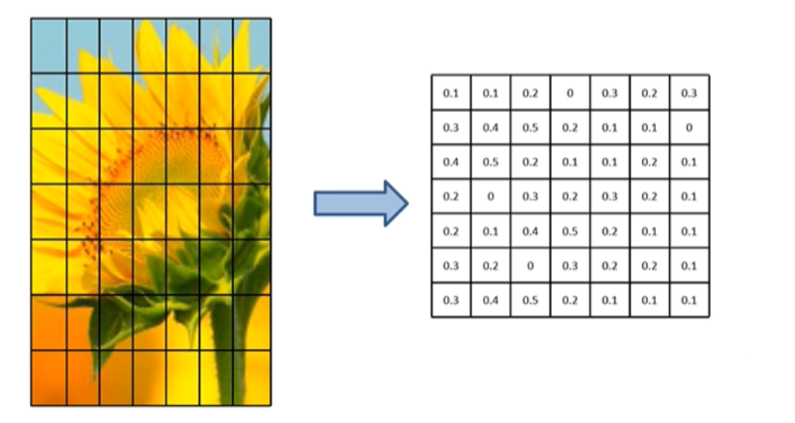

**ROI Pooling 的作用就是把一个任意大小的候选框映射为一个固定大小的特征向量（比如 7×7）**。

操作步骤：
1. 候选框坐标除以 stride（16），缩放到特征图尺度
2. 把候选区域划分为 $k \times k$（比如 7×7 = 49）个大小相等的子区域
3. 每个子区域内做 Max Pooling，输出一个值
4. 最终得到一个 $k^2 \times C$（49 × 通道数）的固定长度特征向量

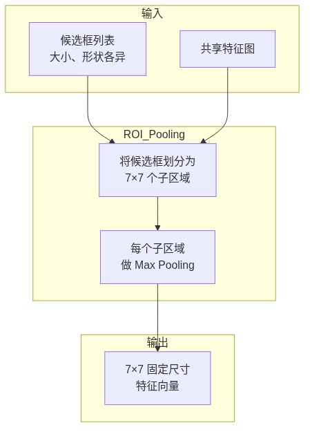

**ROI Pooling 存在一个问题——量化误差**

划分过程中有两次"取整"操作：
1. 将原图坐标缩放到特征图时，坐标是浮点数但像素位置是整数——取整
2. 分配子区域时，区域大小可能不是整数——取整

这两次取整在检测任务中问题还不算太大（差一两个像素一般也不影响判断），但在**实例分割**这种需要像素级精度的任务里就很致命了。

### 6.5.7 ROI Align —— 消除量化误差

ROI Align（出自 Mask R-CNN）的改进思路很自然：**既然取整会造成误差，那就不取整，用插值**。

ROI Align 的具体做法：
1. 保留浮点坐标，不取整
2. 划分子区域后，在每个子区域内**均匀采样 4 个点**
3. 对每个采样点用**双线性插值**（利用周围 4 个真实像素计算插值结果）获得精确的像素值
4. 取 4 个采样点的 Max 或 Average

全程没有量化取整，每个值都是"算出来的精确值"。ROI Align 现在是目标检测和实例分割任务的标准配置。

### 6.5.8 最终的分类与精修

ROI Pooling/Align 之后，流程就进入了收尾阶段：

- 特征向量送入全连接层
- 分类分支：Softmax 输出该候选框属于每个类别的概率（包括一个"背景"类）
- 回归分支：对每个类别输出一组精修偏移量，再次微调边界框

这里的损失函数和 RPN 类似，也是分类损失 + 回归损失的多任务形式。最后再过一次 NMS，去除同一类别中高度重叠的框，就得到了最终的检测结果。

### 6.5.9 小结

回顾 Faster R-CNN 的完整流程：

1. 整张图送入 Backbone → 共享特征图
2. RPN 在特征图上滑动，为每个位置生成 9 个 anchor，输出前景/背景分数和位置修正量 → 约 300 个高质量候选框
3. 候选框映射回特征图 → ROI Pooling/Align 统一尺寸 → 全连接层
4. 最终分类 + 回归精修 → NMS 去重 → 输出

Faster R-CNN 的核心贡献是什么？**用 RPN 替代外部算法，使整个系统"学"出了候选框生成的能力，实现了真正的端到端训练**。这个架构范式影响深远——今天很多检测器虽然外观不同，但底层大多能找到 RPN + ROI 的影子。

---

## 6.6 One-Stage 检测器：YOLO 系列

如果说 Faster R-CNN 代表了两阶段范式的最高水准，那 YOLO 系列就是单阶段范式的旗帜。YOLO 的名字本身就是宣言——**You Only Look Once（你只需要看一次）**——强调的就是直接把检测问题一步到位地解决。

### 6.6.1 YOLOv1 —— 把检测变成一个回归问题

YOLOv1（2015）提出的思想在当时是颠覆性的。之前的主流做法都是"先找候选区域，再逐个分类"，而 YOLOv1 说：**不用那么麻烦，把整张图喂给一个神经网络，直接输出所有检测结果**。

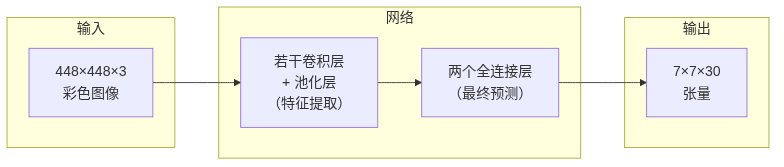

核心机制是**网格划分**。让我一步一步拆解：

**第一步**：把输入图像平均分成 $S \times S$ 个格子（$S=7$）。就像在图像上画了一个 7×7 的棋盘。

**第二步**：如果某个目标的**中心点**落在了某个格子里，那么这个格子就"承包"了这个目标的检测任务。每个格子最多预测 $B$ 个目标（$B=2$）。

**第三步**：每个格子要输出三类信息：

- **$B$ 个边界框**，每个框 5 个值：$(x, y, w, h, confidence)$
  - $(x, y)$：框的中心坐标，**相对于当前格子的偏移**（不是整张图），范围 0~1
  - $(w, h)$：框的宽高，**相对于整张图的比例**（不是像素值），范围 0~1
  - $confidence$：置信度 = $\text{Pr(Object)} \times \text{IoU}_{\text{pred}}^{\text{truth}}$（即该框包含目标的概率乘上预测框与真实框的 IoU）
- **$C$ 个类别概率**：条件概率 $\text{Pr(class} \mid \text{object)}$（在该格子已包含目标的前提下，属于各个类别的概率），VOC 数据集 20 类

**第四步**：把所有信息拼起来。输出张量的维度是 $S \times S \times (5B + C)$ = $7 \times 7 \times (10 + 20)$ = $7 \times 7 \times 30$。

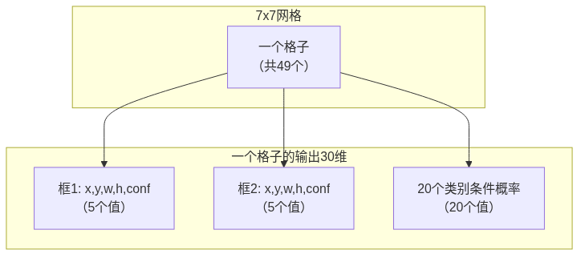

YOLOv1 的设计非常优雅——检测被完全简化为一个回归问题，没有复杂的中间步骤。但代价也很明显：7×7 的粗糙网格意味着**小目标和密集目标效果很差**——一个格子里挤了多个小目标，YOLOv1 也只能检测出 2 个。而且直接用全连接层预测，空间信息丢失较多。

> **理解 YOLOv1 的关键**：它把检测问题重新定义为"空间划分 + 每个格子独立预测"。虽然精度不如两阶段方法，但它证明了单阶段检测器的可行性，为后续所有 YOLO 版本奠定了基础。

### 6.6.2 奠基阶段（YOLOv2 ~ YOLOv3）

**YOLOv2（2016）** 是多点开花的改进版本：

最关键的改动是**引入 Anchor 机制**。YOLOv1 让网络直接预测绝对坐标，YOLOv2 改成了预测"相对于 anchor 的偏移"。怎么确定 anchor 的尺寸？用 **K-means 在训练集标注框上聚类**，自动找出最好的一组 anchor。这不仅更贴合数据，还大幅提升了定位精度。

其他重要改进：
- 每层都加 **Batch Normalization**，训练更稳定，mAP 涨了 2%
- 先在 448×448 的高分辨率上微调分类网络，再切到检测——让网络适应高分辨率输入
- **多尺度训练**：每 10 个 batch 随机换一个输入分辨率，网络对不同大小的图都能处理

**YOLOv3（2018）** 最重要的改进是**多尺度预测**。它不再只在最后一层特征图上做检测，而是在 3 个不同分辨率的特征图上各做一次——大分辨率图检测小目标，小分辨率图检测大目标。这和 FPN 的思路一致，大幅提升了小目标的检测效果。

另外，YOLOv3 的 Backbone 换成了 **Darknet-53**（53 个卷积层 + 残差连接），ImageNet 分类精度匹敌 ResNet-152，但速度快了 2 倍。

### 6.6.3 工程化精进阶段（YOLOv4 ~ YOLOv7）

这一阶段的共同特点不是单一突破，而是**系统性地整合各种技巧，在工程上做到极致**。

**YOLOv4（2020）** 最经典——它把当时所有有效的技巧系统地组织成两类：

- **Bag of Freebies（白送的技巧）**：训练时用、推理时不增加计算量——Mosaic 数据增强、CIoU 损失、标签平滑、余弦退火学习率……全加上
- **Bag of Specials（花点小钱的技巧）**：推理时略微增加计算但大幅提升精度——CSPDarknet53 骨干、SPP 模块、PANet 特征融合、Mish 激活函数

YOLOv4 的整体架构确立了后续 YOLO 版本的基础框架——Backbone + Neck + Head 三段式结构：

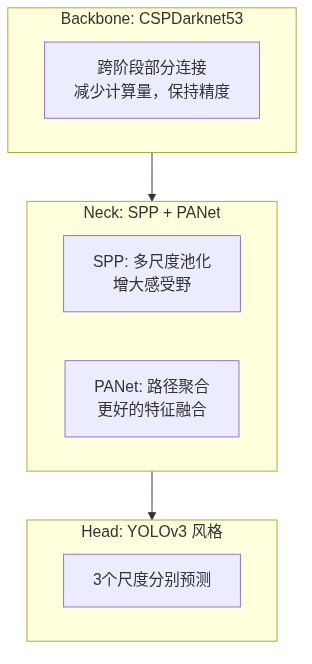

#### 6.6.3.1 YOLOv5 —— 工程化标杆

YOLOv5（2020）虽然没发论文，但在工业界的影响力远超大多数有论文的模型。它的核心贡献不是某个算法上的突破，而是**把目标检测的工程化做到了极致**。

**整体架构**

YOLOv5 继承了 YOLOv4 的 Backbone-Neck-Head 三段式设计，但在每个阶段都做了精心的工程优化：

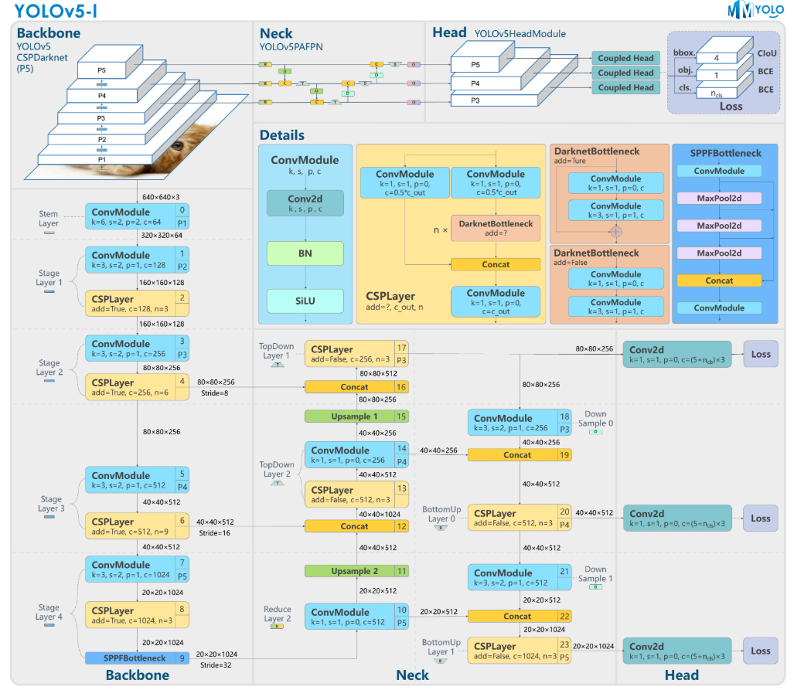

**C3 模块 —— 骨干的基本单元**

C3（CSP Bottleneck with 3 convolutions）是 YOLOv5 骨干网络的核心构建块，它借鉴了 CSPNet（跨阶段部分网络）的思想：

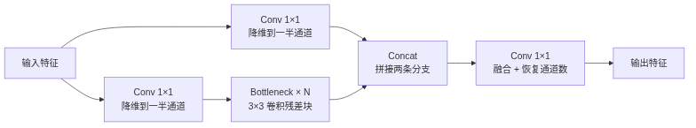

C3 的设计哲学是"分而治之"——将输入通道一分为二，一半经过 Bottleneck 做深度特征提取，另一半走捷径直接透传，最后再拼回来。这样做的效果是：**梯度可以通过 shortcut 路径更直接地回传到浅层**（缓解深层网络的梯度消失），同时只对一半通道做卷积也降低了计算量。

**模型族 —— 一套设计，五种规格**

YOLOv5 最大的工程创新之一就是通过两个简单的参数——深度乘数（depth_multiple）和宽度乘数（width_multiple）——控制模型大小，生成了 5 种规格：

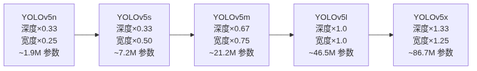

- **深度乘数**：控制每个 C3 模块中 Bottleneck 的重复次数——乘数越大，网络越深，特征提取能力越强
- **宽度乘数**：控制每层卷积的输出通道数——乘数越大，每层能学到的特征越多

> 从 YOLOv5n（1.9M 参数，适合树莓派）到 YOLOv5x（86.7M 参数，适合云端 GPU），用的都是**同一套架构代码**，只是改了这两个数字。这种设计让开发者可以根据硬件条件灵活选用，而不需要重新设计网络。

**YOLOv5输出结构解析**

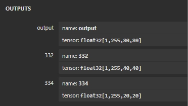

维度含义

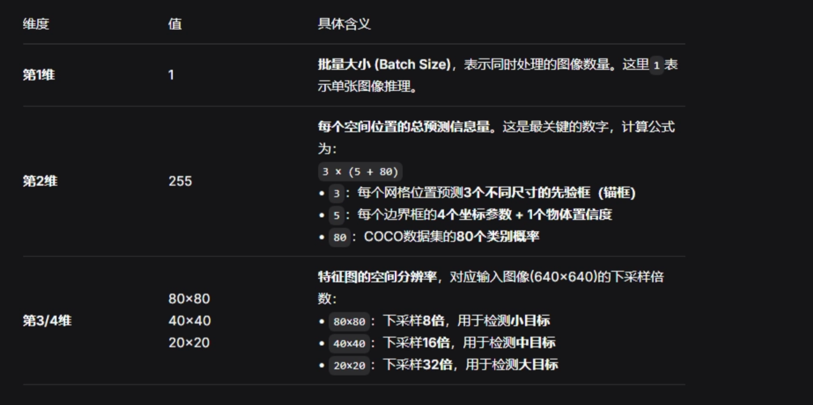

结果解析
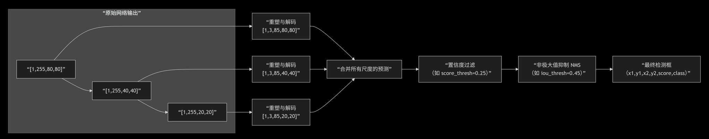

**为什么 YOLOv5 如此流行？**

YOLOv5 的火爆不是偶然。它同时拥有三样东西：
- **PyTorch 原生实现**：代码简洁易读，社区贡献门槛低
- **完善的部署工具链**：一键导出到 TensorRT、ONNX、CoreML、TFLite，覆盖云-边-端全场景
- **开箱即用的训练流程**：自动数据增强、自动锚框聚类、自动学习率调度，降低了上手成本

这套"论文可以不发，代码一定要好用"的理念，让 YOLOv5 成了目标检测领域事实上的工程标准。

**YOLOv6（2022）** 美团出品，主打**结构重参数化**——训练时用多分支结构追求更好性能，推理前把多分支"融合"成单路来提速。RepVGG 风格的 EfficientRep 骨干就是这个思想的体现。

**YOLOv7（2022）** 提出了 **E-ELAN（扩展高效层聚合网络）**，在保持梯度完整性的同时提升网络学习能力，并大规模应用了模型重参数化技术。

### 6.6.4 现代化转型阶段（YOLOv8 ~ YOLOv13）

从 YOLOv8 开始，YOLO 系列进入了全新的阶段——抛掉历史包袱，全面拥抱现代化设计。

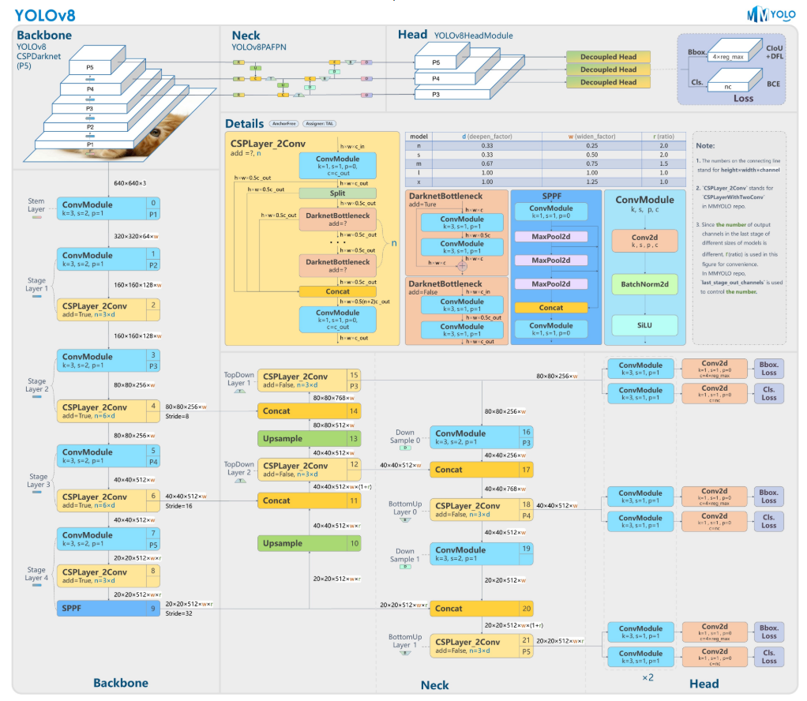

**YOLOv8（2023）是最重要的转折点**，它做了三个根本性的架构改变：

**改变一：C2f 替换 C3 模块**

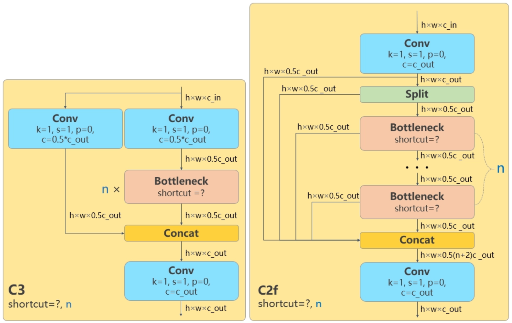

C2f 借鉴了 YOLOv7 的 ELAN 设计——更多的跳层连接（skip connection）+ Split 操作。这带来了**更丰富的梯度回传路径**（训练更容易），同时因为砍掉了分支中的部分卷积，计算量反而更低。

**改变二：解耦头（Decoupled Head）替代耦合头**

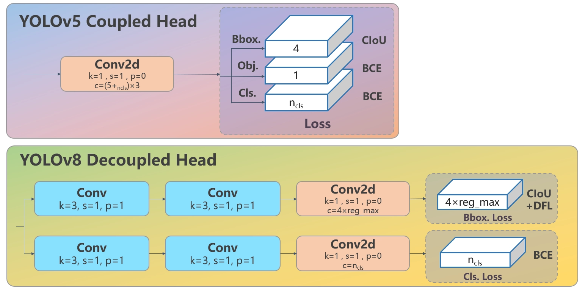

在 YOLOv5 中，分类和定位是用同一层卷积完成的（耦合设计）。YOLOv8 把它们拆成了两条独立的分支——分类分支专注语义特征，回归分支专注空间特征。道理很简单：**判断"这是什么"和"它在哪"是两个不同性质的任务，不应该混在一起**。

**改变三：彻底抛弃 Anchor，转向 Anchor-Free**

这可能是最激进的一步。YOLOv8 不再预设任何 anchor，而是直接让网络预测目标的中心点和宽高。配合 DFL（Distribution Focal Loss，把边界框回归建模为位置概率分布的预测）+ CIoU 损失，定位比有 anchor 时更灵活。

YOLOv8 还用了一个叫 **TaskAlignedAssigner** 的正样本匹配策略：

$$\text{align\_score} = \text{class\_score}^\alpha \times \text{IoU}^\beta$$

不是简单地看 IoU 高低，而是把分类质量和定位质量捆在一起评估——"你的分类有把握 AND 你的定位精准"才算好样本。这个设计让置信度分数更有意义：它直接衡量了预测的**整体质量**。

**DFL 机制详解**

YOLOv8 中另一个关键创新是 DFL（Distribution Focal Loss，分布焦点损失）。传统边界框回归直接预测一个坐标值（比如宽度 = 203 像素），但这对模型来说要求很高——网络需要非常精确地输出一个数字。DFL 换了一个思路：**不直接预测一个值，而是预测一个位置的概率分布**。

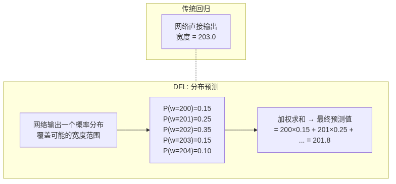

具体来说，DFL 把边界框的每条边（左、上、右、下）的坐标范围划分为 $n$ 个离散位置，网络为每个位置输出一个概率值。最终的坐标值通过对这 $n$ 个位置做**概率加权求和**得到。这样做有两个好处：

- **定位更精确**：概率分布可以"捕捉"到亚像素级别的偏移——即使离散位置的步长是 1 像素，通过概率加权也可以输出 201.8 这样的浮点值
- **对小偏移敏感**：网络不仅要让"正确位置"附近的概率高，还要让离正确位置越远的概率越低（用 cross-entropy 约束整个分布的形状），这比直接回归 L1/L2 损失提供了更丰富的梯度信号

> DFL 可以理解为：把"定位"这个回归问题重新表述为一个"在有限个候选位置上做概率分类"的问题。回归 → 分类，网络学起来更稳定。

**YOLOv9（2024）** 聚焦在深层网络的信息瓶颈问题上，提出 PGI（可编程梯度信息），让深层也能接收到完整的输入信息。

**YOLOv10（2024）** 实现了 YOLO 系列多年来的终极目标——**真正的端到端、无需 NMS**：

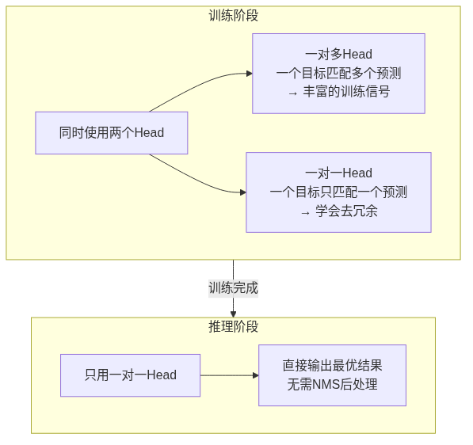

核心思想是**让模型在训练阶段就学会"做选择"**——通过一对一标签分配强迫模型为每个目标只保留一个最优的预测框。既然模型训练时已经学会了"一个目标只出一个框"，推理时自然就不再需要 NMS 去冗余了。

**YOLOv11（2024）—— 多任务统一**

如果说 YOLOv8 是"内部架构重构"，那 YOLOv11 就是"能力横向扩展"。它是 Ultralytics 首个官方多任务统一框架——一个模型同时支持检测、实例分割、旋转框检测（OBB）和人体姿态估计。

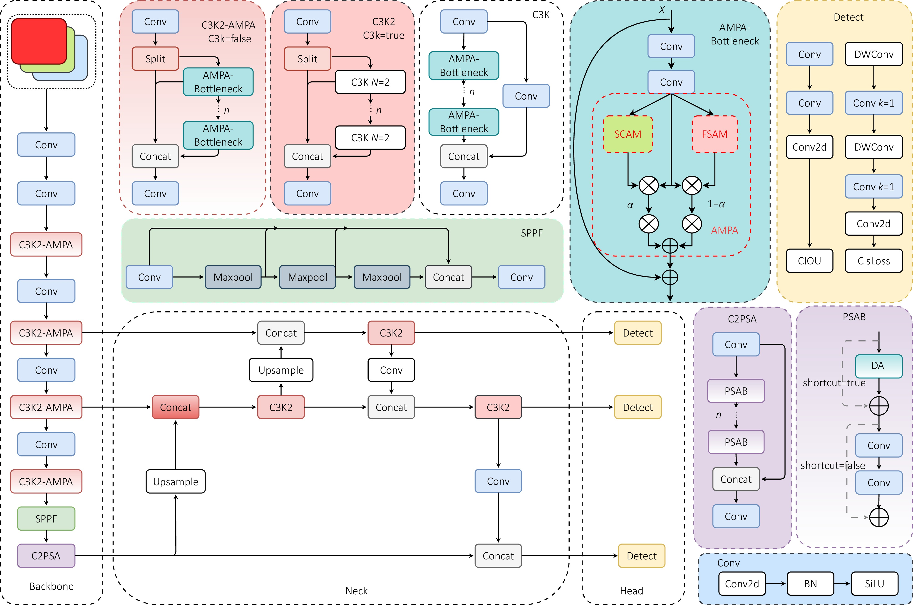

**C3k2 模块 —— 更高效的骨干单元**

YOLOv11 把骨干瓶颈块从 C2f 替换为 C3k2。C3k2 的设计目标是——用更少的计算成本实现同等或更好的特征提取效率：

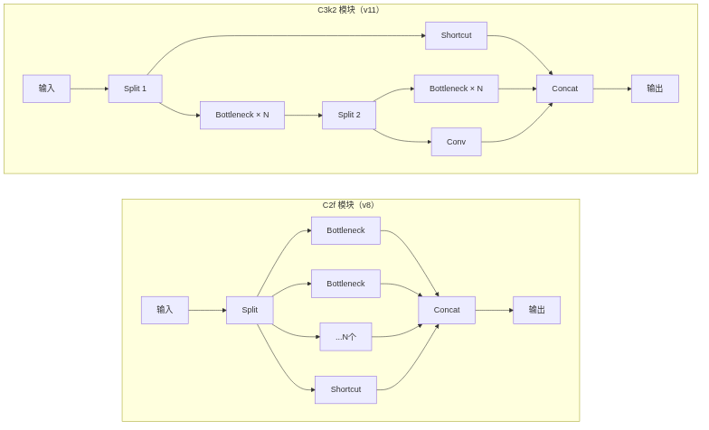

C3k2 的核心思路是在更低的通道维度上做计算——通过额外的 Split 操作将特征拆得更细，只在必要的地方保留 Bottleneck 的深度处理能力。结果就是：计算量比 C2f 更小，但对关键特征的提取能力不打折扣。

**C2PSA 模块 —— 给特征图加上"空间注意力"**

除了 C3k2，YOLOv11 在骨干网络中还引入了一个新模块——**C2PSA（C2f with Position-Sensitive Attention）**。它接在 SPPF（空间金字塔池化）模块之后，承担一个关键任务：**在特征进入 Neck 做多尺度融合之前，先给特征图做一次空间维度的注意力增强**。

要理解 C2PSA，先拆它的名字：

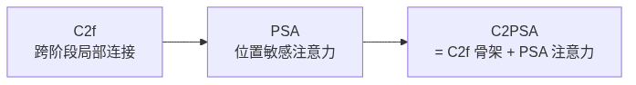

- **C2f 骨架**：沿用了 YOLOv8 引入的跨阶段局部连接设计——先 Split 通道，一部分走 Bottleneck 做深度特征提取，另一部分直接旁路透传，最后 Concat 在一起。这种设计保证信息流既经过了深度加工，又不丢失原始细节
- **PSA（Position-Sensitive Attention）**：这是 C2PSA 的核心创新。它与标准的自注意力不同——标准自注意力对全局位置一视同仁，而 PSA **根据空间位置的重要性分配不同的注意力权重**

PSA 的工作流程如下：

1. **多尺度分组**：将输入特征图按通道均分成 $G$ 组，每组负责捕捉不同粒度的空间依赖关系
2. **分组内注意力**：在每一组内做局部窗口式的注意力计算——每个位置只关注它邻域内的其他位置，而不是整张特征图。这让计算量从 $O(H^2 W^2)$ 降到了 $O(HW \cdot k^2)$（$k$ 为窗口大小）
3. **跨组融合**：各组输出重新拼接后，通过一个轻量的 $1 \times 1$ 卷积做跨通道信息混合
4. **残差连接**：注意力增强后的特征与原始输入相加，保证即使注意力权重没学到东西，特征也不会退化

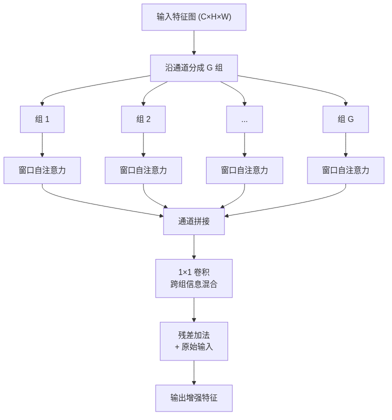

> C2PSA 的设计哲学是"局部感知 + 分组高效"。它既不是 ViT 那样的全局自注意力（太重），也不是纯 CNN 的固定感受野（太死板）。它在计算开销和注意力表达力之间找到了一个非常好的平衡点，使骨干网络在 SPPF 之后能够"重新审视"哪些空间位置对后续检测最关键。

**多任务 Head 架构**

YOLOv11 的真正亮点在于 Head 的多任务扩展。不同于训练 4 个独立模型，YOLOv11 共享 Backbone 和 Neck，只在 Head 层分支处理不同任务：

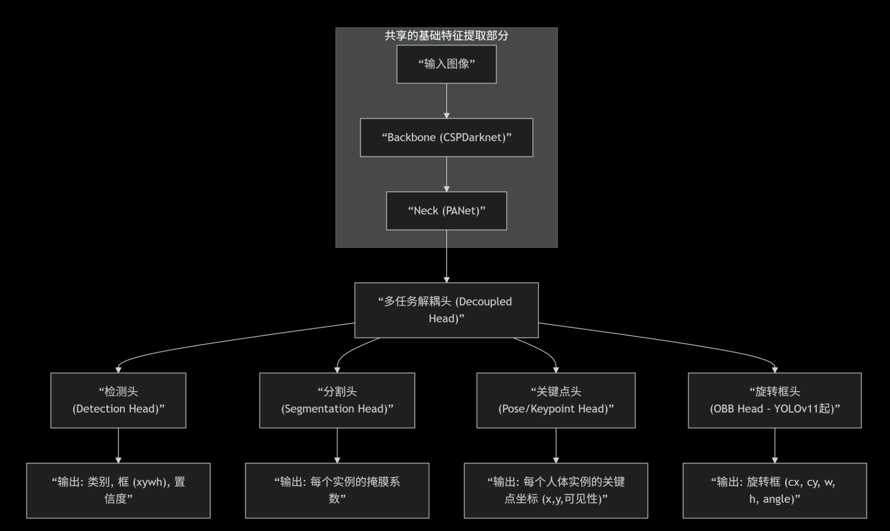

四个 Head 各有特点：

- **检测 Head**：标准配置，分类分支 + 回归分支，输出 4 个坐标值定义边界框
- **分割 Head**：分两步——先生成一组共享的**掩膜原型**（prototype masks，覆盖全图的基础掩膜模板），再为每个检测到的实例预测一组**掩膜系数**（mask coefficients，在当前原型上的线性组合权重）。原型 × 系数的组合 = 每个实例独有的二值掩膜。这种"原型 + 系数"的设计非常高效——原型只需算一次，每个实例只需多输出几个系数
- **姿态估计 Head**：在检测头的基础上增加关键点回归分支，直接预测人体 17 个关键点的坐标和每个点的可见性（可见/遮挡/不在图中）。关键是：关键点坐标是基于检测框中心做归一化偏移，不依赖全图坐标，这让预测更稳定
- **OBB Head（旋转框检测）**：传统的水平框只能输出 $(cx, cy, w, h)$，旋转框多了一个角度维度 $(cx, cy, w, h, angle)$，能更紧密地包裹倾斜的物体（比如航拍图中的船只）。损失函数也做了相应调整以适应角度的周期性

> YOLOv11 的核心意义：**一个模型 = 四个任务的解决方案**。以前需要部署 3-4 个模型才能覆盖检测、分割、姿态估计的需求，现在一个模型全包了，不仅节省了部署维护成本，共享的 Backbone+Neck 也让多任务之间可以相互增强。

**YOLOv12/YOLOv13（2025）** 分别引入了区域注意力模块和超图关联增强模块，继续在精度和效率上做精细打磨。

### 6.6.5 YOLOv26 —— 极简主义的边缘革命

到了 YOLOv26，迭代方向发生了根本性转变——**不是再加功能，而是做减法**。一切都是为了一个目标：让模型在 CPU 和边缘设备上以代际飞跃的速度运行。

YOLOv26 把四个"不必要的"东西砍掉了：

**1. 砍掉 DFL（Distribution Focal Loss）**

DFL 的机制前面介绍过——把边界框回归建模为位置概率分布，用加权求和得到最终坐标。这确实提升了定位精度，但它有两个实际代价：

- **推理开销**：DFL 需要维护 $n$ 个离散位置的概率输出（通常 $n=16$），然后做 softmax + 加权求和。在 GPU 上这点开销不算什么，但在 CPU/边缘 NPU 上，每一步额外的数学运算都在挤压本就不富裕的算力预算
- **部署复杂度**：DFL 的输出结构不是标准的回归头，有些推理框架（尤其是边缘端的轻量框架）需要特殊适配

YOLOv26 直接砍掉 DFL，回到更直接的回归方式——用实践证明在大量边缘场景下，DFL 带来的那点精度提升不值得那个计算成本。

**2. 砍掉 NMS —— 原生端到端**

YOLOv10 已经探索了"训练时端到端、推理时无 NMS"的路子，YOLOv26 做得更彻底。关键不在于"不用 NMS"这个结果，而在于**训练阶段的设计让模型自然而然地就不出重复框**：

- **一对一标签分配**：每个真实目标在训练时只匹配一个最优预测框——模型从根源上学到了"一个目标只出一个框"
- **内部竞争机制**：相邻位置的预测之间形成隐式竞争，迫使模型自己决定由哪个位置"负责"某个目标

推理时直接输出，没有 NMS 后处理延迟——这在对延迟敏感的实时系统中意义重大。

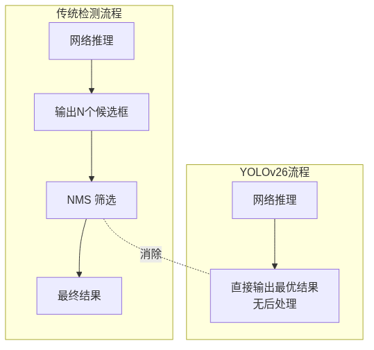

**3. ProgLoss + STAL —— 让训练更稳、小目标更好**

边缘部署场景的痛点是什么？图像质量差、小目标多、光照不足。传统的标签分配和损失加权策略对这些情况不够敏感。YOLOv26 引入了两个针对性策略：

- **ProgLoss（Progressive Loss Balancing，渐进式损失平衡）**：任务A（分类）、任务B（定位）、任务C（DFL 已被移除但可能还有置信度回归）的损失不是简单相加，而是让模型在训练早期优先学好"容易的"任务，随着训练推进逐步增加"难的"任务的权重。这就像学开车——先练直线，再练弯道，最后上高速
- **STAL（Small Target Aware Label assignment，小目标感知标签分配）**：针对小目标（面积很小，特征弱）修改了正负样本匹配逻辑——给靠近小目标中心点的位置更高的匹配优先级，让网络更不容易漏掉这些"小东西"

两项结合，模型在边缘场景中的可靠性明显提升——小目标召回率提升而不牺牲大目标精度。

**4. MuSGD 优化器 —— 从大模型训练中"偷师"**

MuSGD 的灵感来自大语言模型训练——Moonshot AI 的 Kimi K2 训练经验被融合到了 SGD 框架中。SGD 的传统优势是**泛化能力强**（因为每次更新的噪声天然起到了正则化作用），但**收敛慢**（因为步长和方向都不够"聪明"）。MuSGD 保留了 SGD 的泛化优势，同时通过动量和自适应调节大幅提升了收敛速度和训练稳定性。

> YOLOv26 的哲学是"能不要的都不要"。这不是为了炫技，而是为了回答一个根本问题：**一个检测器最少需要什么才能有效工作？** 答案是——不需要 DFL、不需要 NMS、不需要复杂的优化器。极简不代表简陋，而是用更聪明的训练策略弥补架构的"朴素"。

### 6.6.6 YOLO 系列演进总结

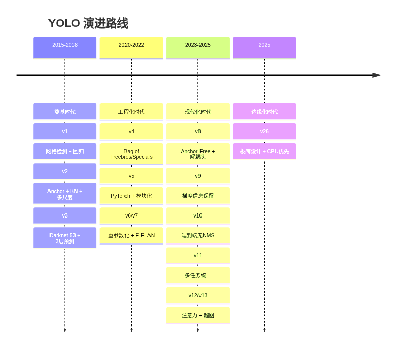

演进主线非常清晰：**精度 → 速度与精度的平衡 → 多任务统一 → 极致边缘部署**。

---

## 6.7 YOLO 版本对比

下面选取三代关键版本（YOLOv5 → YOLOv8 → YOLOv11 → YOLOv26），对比它们在架构设计上的核心变迁。理解这种变迁，比记住每个版本的细节更重要。

### 6.7.1 YOLOv5 → YOLOv8：从 Anchor-Based 到 Anchor-Free 的跨越

这是 YOLO 历史上最彻底的一次架构重构，几乎每个模块都变了。

**Backbone 变了什么？**

最简单的变化是模块名从 C3 换成了 C2f，但背后的设计哲学完全不同。C3 是一个比较简单直接的 CSP 模块——三条分支汇合，计算沿着固定路径走。C2f 借鉴了 YOLOv7 ELAN 的设计，在 C3 基础上加了更多的跳层连接和 Split 操作，取消了分支中的部分卷积。

理解 C2f 优势的关键是**梯度流**——训练时反向传播的梯度通过更多路径回流到浅层，深层网络收到更丰富的梯度信息。同时因为砍掉了一些卷积，计算量还少了。这就像修路——C3 是三条主干道，C2f 是主干道 + 一堆小支路，交通（梯度）更通畅，还更省地（计算量）。

**Neck 变了什么？**

两者都使用 PAN-FPN 结构（一种在 FPN 自顶向下基础上又加了自底向上路径的特征融合方式）。YOLOv8 在 Neck 中也用 C2f 替换了 C3，并去掉了上采样阶段的部分卷积。

**Head —— 变化最大的部分**


三个核心差异：

| 维度 | YOLOv5 | YOLOv8 | 为什么更好 |
|---|---|---|---|
| **Head 结构** | 耦合头：一层卷积分时做分类+定位 | 解耦头：两条独立分支 | 分类关注"是什么"（语义），定位关注"在哪"（空间），分开后互不干扰 |
| **Anchor 方式** | Anchor-Based：预设锚框，预测相对偏移 | Anchor-Free：直接预测中心+宽高 | 去掉锚框超参数，流程更简洁，小目标更友好 |
| **标签分配** | 基于 IoU 的简单匹配 | TaskAlignedAssigner | 同时评估分类质量和定位质量，匹配更合理 |
| **置信度意义** | 存在性分数 × 类别分数 | 对齐分数（分类和定位的联合质量） | 置信度高 = 分类有把握 AND 定位精准，更可信 |

从 YOLOv8 往后，YOLO 系列全面转向 Anchor-Free。这不是偶然——去掉锚框意味着更少的超参数、更简单的正负样本定义、更高效的解码。实践证明 Anchor-Free 不仅没有损失精度，反而因为更灵活带来了提升。

### 6.7.2 YOLOv8 → YOLOv11：从单一检测到多任务统一

如果说 v5→v8 是"内部重构"，那 v8→v11 就是"能力扩展"。

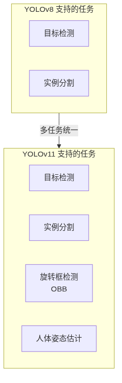

架构层面，YOLOv11 有两个关键模块变更：把骨干瓶颈块从 C2f 换成了 **C3k2**（更小的计算成本，更高效的特征提取），并在 SPPF 之后引入了 **C2PSA**（位置敏感注意力模块），用"分组局部注意力"的方式增强空间特征表达。其余基础配置（Anchor-Free、解耦头、TaskAlignedAssigner）基本保持不变。

真正的亮点在于 **Head 的多任务扩展**：

- **检测**：标准分类分支 + 回归分支，输出边界框和置信度
- **分割**：在检测头基础上，增加掩膜原型分支（生成共享的原型掩膜）和掩膜系数分支（为每个实例选择原型掩膜的权重），最终每个实例得到独立的二值掩膜
- **姿态估计**：在检测头基础上，增加关键点回归分支，直接预测人体关键点的坐标和可见性
- **旋转框（OBB）**：标准回归输出 4 个参数，旋转框输出 5 个——多了个角度 $(cx, cy, w, h, angle)$，并调整损失函数以适应角度的周期性


YOLOv11 的核心意义在于：**一个模型 = 多个任务的解决方案**。以前需要部署 3-4 个模型才能覆盖检测、分割、姿态估计的需求，现在一个模型全包了。

| **任务类型**         | **核心输出/目标**                                 | **检测头关键设计**                                           | **主要损失函数**                                             |
| -------------------- | ------------------------------------------------- | ------------------------------------------------------------ | ------------------------------------------------------------ |
| **检测 (Detect)**    | 类别、矩形框(`x,y,w,h`)、置信度                   | 分类与回归解耦的双分支头，无锚框设计。                       | – 分类: `BCE Loss`– 回归: `DFL Loss` + `CIoU Loss`           |
| **实例分割 (Seg)**   | **每个实例**的二值掩膜                            | 在检测头基础上，**增加一个掩膜原型分支**和**掩膜系数分支**。 | – 检测部分: 同上– 分割: `BCE Loss` (掩膜与GT掩膜的损失)      |
| **姿态估计 (Pose)**  | 每个人体实例的**关键点坐标** (`x,y`) 和**可见性** | 在检测头基础上，**增加一个关键点回归分支**，直接预测每个关键点的相对坐标。 | – 检测部分: 同上– 关键点: `BCE Loss` (可见性) + `MSE Loss` (坐标) |
| **旋转框检测 (OBB)** | 带角度的矩形框 (`cx,cy,w,h,angle`)                | 在回归分支中将4个参数扩展为**5个参数** (`cx,cy,w,h,angle`)，并调整损失函数以适应角度周期性。 | – 分类: `BCE Loss`– 回归: `DFL Loss` + `Rotated CIoU Loss`   |

### 6.7.3 YOLOv11 → YOLOv26：为边缘而生的极简主义

如果说 v8→v11 是"做加法"（加任务、加能力），那 v11→v26 就是**做减法**——把一切对边缘部署不必要的东西都砍掉。

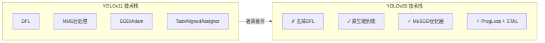

逐条拆解 YOLOv26 为什么这么做：

**1. 去掉 DFL**

DFL 的机制是把边界框回归建模成一个概率分布预测——比如宽度不是直接预测"203 像素"，而是预测"可能是 200、201、202……"等一系列离散值上的概率，然后加权平均。这样做的好处是定位更精确（尤其对小偏移敏感），但代价是增加了推理时的计算和部署复杂度。

在算力充裕的 GPU 上这不叫事，但在 CPU/边缘设备上，每多一步计算就是一个瓶颈。YOLOv26 直接砍掉 DFL，回到更简单的回归方式——用实践证明在很多场景下，DFL 带来的那点精度提升不值得那个计算成本。

**2. 原生端到端，彻底不用 NMS**

YOLOv10 已经探索了端到端的路子，YOLOv26 做得更彻底。关键不在于"不用 NMS"这个结果，而在于**训练阶段的设计让模型自然而然地就不出重复框**——一对一标签分配 + 内部竞争机制确保了每个目标只有一个最优预测。推理时直接输出，没有后处理延迟。

**3. ProgLoss + STAL**

边缘场景的痛点是什么？小目标多、低光照、可见度低。传统的标签分配和损失加权策略对这些情况不够敏感。ProgLoss（渐进式损失平衡）让模型在训练过程中逐步调整对不同难度样本的注意力，STAL（小目标感知标签分配）则专门为小目标优化了正负样本的匹配逻辑。两项结合，模型在边缘场景中的可靠性明显提升。

**4. MuSGD 优化器**

这个优化器的灵感来自大语言模型训练——Moonshot AI 的 Kimi K2 训练经验被融合到了 SGD 框架中。SGD 的传统优势是泛化能力强（因为噪声大），但收敛慢；MuSGD 保留了 SGD 的泛化优势，同时大幅提升了收敛速度和训练稳定性，在大型复杂数据集上表现突出。

### 6.7.4 三代演进大图景

把三代版本的关键变化放在一起，演进图景非常清晰：

| 对比维度 | YOLOv5 | YOLOv8 | YOLOv11 | YOLOv26 |
|---|---|---|---|---|
| **Anchor** | Anchor-Based | Anchor-Free | Anchor-Free | Anchor-Free |
| **Head** | 耦合头 | 解耦头 | 解耦头 | 解耦头 + 简化 |
| **骨干模块** | C3 | C2f | C3k2 | 极致轻量 |
| **注意力机制** | 无 | 无 | C2PSA（位置敏感） | 简化注意力 |
| **DFL** | 无 | 有 | 有 | **移除** |
| **NMS** | 需要 | 需要 | 需要 | **不需要** |
| **多任务** | 仅检测 | 检测 + 分割 | + OBB + 姿态 | + 优化版全任务 |
| **优化器** | SGD | SGD/Adam | Adam | **MuSGD** |
| **设计哲学** | 工程化落地 | 架构现代化 | 能力横向扩展 | 边缘纵向深挖 |

概括三代演进的主题：**v5→v8 是架构革命（去掉历史包袱），v8→v11 是能力扩展（一个模型干更多事），v11→v26 是极致回归（砍掉一切非必要的，让模型在最小设备上跑起来）**。

---

## 本章小结

这一章我们从零开始，把目标检测的核心知识体系走了一遍。来回顾一下学到的东西：

- **原理层面**：目标检测 = 分类 + 定位，Two-Stage（先搜后看）和 One-Stage（一眼报答案）各有取舍。核心挑战是尺度变化、遮挡、小目标和速度精度的平衡
- **评价层面**：从 TP/FP/FN 的基础概念出发，通过班级分类例子和街景检测例子建立直觉。Precision（不乱报）和 Recall（不漏检）互为制约，mAP 以 IoU 为基础，通过 5 步 P-R 曲线积分同时衡量误检、漏检和定位精度。COCO 的 AP@[.5:.95] 是目前最通用的标准
- **组件层面**：Anchor 提供了一个"位置先验"（但正在被 Anchor-Free 取代），NMS 用来消除重复检测（正在被端到端机制替代），数据增强通过随机变换扩充训练集，Label Smoothing 防止模型对标签过度自信
- **损失函数层面**：从 Smooth L1 到 CIoU 的五个版本，每一代都在损失函数中编码了更多的几何信息——重叠面积 → 最小闭包 → 中心距离 → 宽高比。CIoU 是目前的标配，DFL 通过把定位重构为概率分布问题，为 Anchor-Free 时代提供了关键补充
- **两阶段方法**：Faster R-CNN 的 RPN 是核心创新——用网络学会"看哪里"，替代了外部算法。ROI Align 用双线性插值消除了 ROI Pooling 的量化误差
- **单阶段方法（YOLO 系列）**：从 v1 的 7×7 网格检测到 v26 的极简边缘部署，YOLO 的演进是一部活生生的技术迭代史。关键里程碑：v5 定义了工程化标准（模块化 + 模型族 + 工具链），v8 完成了架构革命（C2f + 解耦头 + Anchor-Free），v11 实现了多任务统一（一个模型覆盖检测/分割/姿态/OBB），v26 回归极简（砍掉 DFL/NMS，为边缘设备做减法）
- **版本对比主线**：v5→v8 架构革命，v8→v11 能力扩展，v11→v26 极简回归。三次迭代恰好代表了三种不同的工程追求
