# Ch7 — 图像分割

## 7.1 图像分割概述

### 7.1.1 什么是图像分割？

在第 6 章中，我们学习了目标检测——用边界框（Bounding Box）框出图像中的目标。但想想自动驾驶场景：如果只用一个矩形框标注前方的行人，这个框里除了行人，还框进了大量路面和背景。对于需要精确到像素的应用（如医学影像、自动驾驶的可行驶区域判断），粗糙的矩形框远远不够。

**图像分割（Image Segmentation）要解决的就是这个问题——对图像中的每一个像素进行分类**，从而精确地划分出哪些像素属于哪个目标或区域。

> 图像分割是"像素级分类"——输入是一张图像，输出是一张与输入同样大小的"标签图"，每个像素点上标注了该像素所属的类别。

图像分类只告诉你"这张图里有猫"，目标检测告诉"猫在 (x, y, w, h) 这个框里"，而图像分割直接告诉你"哪些像素是猫，哪些像素是背景"。

### 7.1.2 分割任务的三种层次

图像分割并非只有一种玩法。根据任务粒度的不同，可以分为三个层次：

**语义分割（Semantic Segmentation）**

语义分割给每个像素打上类别标签，但它只关心"这个像素属于哪个类别"，不区分同类别中的不同个体。比如画面中有三只猫，语义分割会把三只猫的所有像素都标记为"猫"，但不会告诉你哪些像素是第一只猫、哪些是第二只猫。

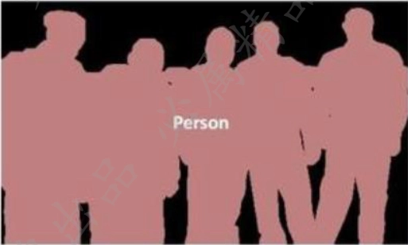

> 语义分割是"一类一色"——同一类别的所有目标共享同一种标签。

**实例分割（Instance Segmentation）**

实例分割更进一步——不仅要区分不同的类别，还要区分同一类别中的不同个体。画面中有三只猫，实例分割会用三种不同的标签分别标记猫 A、猫 B、猫 C。

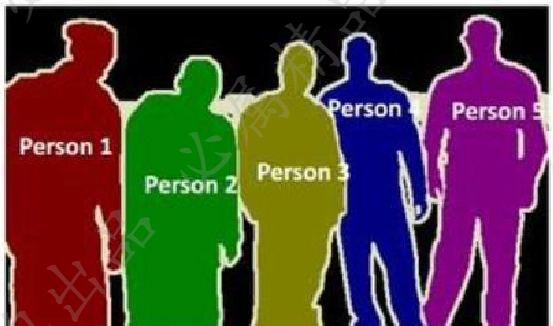

> 实例分割 = 目标检测 + 语义分割：先像检测一样找到每个目标，再像分割一样逐像素标出每个目标的轮廓。

**全景分割（Panoptic Segmentation）**

全景分割是语义分割和实例分割的统一——对"物体"类目标（如人、车、猫——可数、有明确个体）进行实例分割，对"填充"类区域（如天空、草地、路面——不可数、没有明确个体）进行语义分割，最终得到一张覆盖全图所有像素的分割结果。

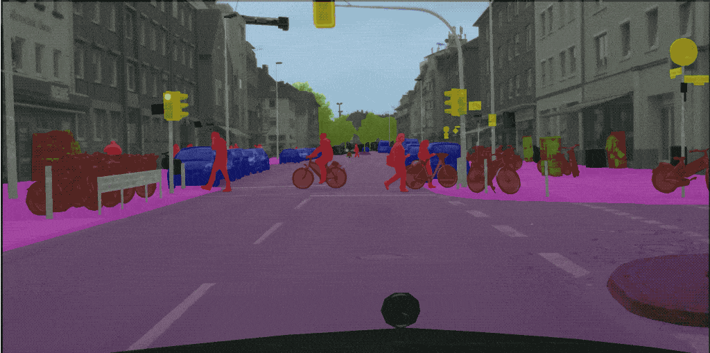

**一句话总结区别：**

- **语义分割**：只关心**类别**（这是猫，那是背景），不关心有几只。
- **实例分割**：只关心**个体**（这是第1只猫，那是第2只猫），通常不管背景。
- **全景分割**：**全都要**！既要分出每只猫（个体），又要给天空草地打标（类别），实现整张图的完整理解。

### 7.1.3 分割的核心难点

图像分割面临以下核心挑战：

| 难点 | 具体表现 |
|:---|:---|
| 类别不均衡 | 前景目标通常只占图像的一小部分，大量像素属于背景，训练时容易被背景主导 |
| 边缘精度 | 目标边界往往模糊，分割网络容易在边缘处"犹豫不决"，导致粗糙的边界 |
| 小目标分割 | 小目标占据的像素少，容易被下采样过程"吞没" |
| 多尺度问题 | 不同目标大小差异很大，网络需要同时理解大到整个场景、小到细节纹理的信息 |

## 7.2 分割中的关键概念

### 7.2.1 损失函数

分割任务的损失函数设计直接决定了模型学得好不好。我们从最基础的讲起。

**逐像素交叉熵（Pixel-wise Cross Entropy）**

交叉熵损失是语义分割中最常用的损失函数。它的计算方式非常直观——对图像中的每一个像素，独立地计算其预测类别分布与真实标签之间的交叉熵，然后对所有像素取平均值：

$$L_{CE} = -\frac{1}{N}\sum_{i=1}^{N}\sum_{c=1}^{C} y_{i,c} \log(p_{i,c})$$

其中 $N$ 是像素总数，$C$ 是类别数，$y_{i,c}$ 是像素 $i$ 在类别 $c$ 上的 one-hot 标签（0 或 1），$p_{i,c}$ 是模型预测像素 $i$ 属于类别 $c$ 的概率。

这个公式背后有一个重要的隐含假设：**所有像素被平等对待**。每个像素对最终损失的贡献是等权的——前景像素也好，背景像素也好，权重都一样。

这个假设在很多场景下是有问题的。

**样本不均衡问题**

想象一张医学 CT 影像，大部分区域是正常组织，病变区域可能只占总像素的不到 1%。如果用普通的交叉熵损失，模型可以"偷懒"地把所有像素都预测为正常，就能获得 99% 的准确率——但这个模型毫无用处。

> 逐像素交叉熵损失平等对待每个像素，但在类别极度不均衡的分割任务中，数量占优的类别会主导梯度更新，导致数量少的类别难以被学到。

解决样本不均衡有几个思路：

**(1) 加权交叉熵（Weighted Cross Entropy）**

给不同类别的像素赋予不同的权重——少数类的像素权重更大，这样模型如果把这些像素分错了，会受到更大的惩罚。

$$L_{WCE} = -\frac{1}{N}\sum_{i=1}^{N} w_c \cdot y_{i,c} \log(p_{i,c})$$

权重 $w_c$ 通常根据类别频率的倒数来设定：像素越少的类别，权重越大。

**(2) Focal Loss**

Focal Loss 最早在目标检测中被提出（RetinaNet），后来也广泛应用于分割任务。它不直接从类别频率出发，而是从样本的"难易程度"出发——让模型更关注那些它现在还分不好的"难样本"，少关注那些已经分对的"简单样本"。

$$L_{focal} = -\frac{1}{N}\sum_{i=1}^{N} (1 - p_{t})^{\gamma} \cdot \log(p_{t})$$

这里 $p_t$ 是模型对正确类别的预测概率。当一个样本很容易分对时（$p_t$ 接近 1），$(1-p_t)^\gamma$ 会非常小，大幅削弱它对损失的贡献；当一个样本很难分对时（$p_t$ 接近 0），$(1-p_t)^\gamma$ 接近 1，几乎不削弱。$\gamma$ 是一个调节因子，通常设为 2。

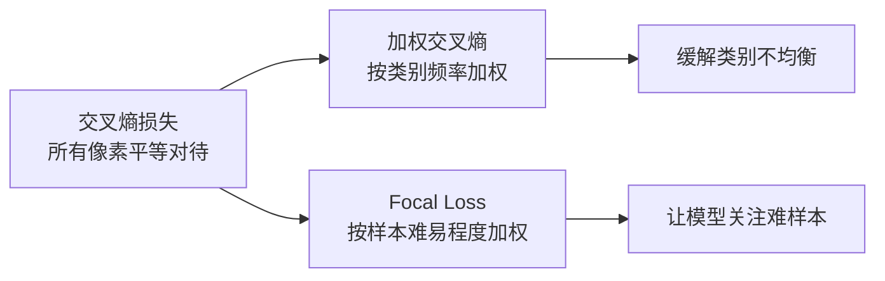

**(3) Dice Loss**

Dice Loss 直接优化 Dice 系数（类似 IoU），它不逐像素计算损失，而是优化预测和 GT 之间的重叠程度：

$$L_{dice} = 1 - \frac{2 \cdot |X \cap Y| + \epsilon}{|X| + |Y| + \epsilon}$$

其中 $X$ 是预测的前景像素集合，$Y$ 是 GT 的前景像素集合，$\epsilon$ 是一个很小的平滑项避免分母为零。Dice Loss 天然对类别不均衡不敏感——它只关心预测区域和真实区域的重叠程度，不关心背景像素有多少。

### 7.2.2 IoU 与 mIoU

分割模型训练好了，怎么评估它好不好呢？最核心的指标是 IoU（Intersection over Union，交并比）。

**IoU 的定义**

对于某一个类别，IoU 衡量的是预测区域和真实区域之间的重叠程度：

$$IoU = \frac{TP}{TP + FP + FN}$$

用更直观的语言说：IoU = 预测区域和真实区域的交集面积 / 预测区域和真实区域的并集面积。

- $TP$（True Positive）：正确预测为该类别的像素数
- $FP$（False Positive）：错误预测为该类别的像素数
- $FN$（False Negative）：漏掉的该类别的像素数

> IoU 的取值范围是 0 到 1。IoU = 1 意味着预测和真实完全吻合；IoU = 0 意味着两个区域毫无交集。

**mIoU（Mean IoU）**

对于多类别分割任务，我们对所有类别的 IoU 取平均值，得到 mIoU：

$$mIoU = \frac{1}{K}\sum_{k=1}^{K} IoU_k$$

其中 $K$ 是类别总数。mIoU 是目前语义分割任务中最标准的评估指标。数值越高，分割质量越好。

> 为什么不直接用 pixel accuracy（正确分类的像素数 / 总像素数）？回到 7.2.1 中医学影像的例子：如果病变区域只占 1% 的像素，模型把所有像素都预测为"正常"，pixel accuracy 高达 99%，但 mIoU 近乎 0。**mIoU 对类别不均衡更敏感，能暴露"假装全对"的模型**。

### 7.2.3 分割数据集与标注格式

搞懂了损失函数和评估指标，我们还需要知道分割任务的数据"长什么样"。分割数据和分类数据最大的不同在于标注——分类只需要一个类别标签，分割需要为图像中的每个像素提供标签。

**主流公开数据集**

实战中你最可能遇到以下数据集：

| 数据集 | 任务 | 类别 | 规模 | 场景 |
|:---|:---|:---|:---|:---|
| PASCAL VOC 2012 | 语义+实例 | 20前景+背景 | ~10k（增强后） | 通用场景入门 |
| COCO | 实例+全景 | 80物体+91stuff | ~118k训练 | 实例分割标准基准 |
| Cityscapes | 语义+实例 | 19类 | ~5k精细标注 | 城市街景/自动驾驶 |
| ADE20K | 语义+全景 | 150类 | ~20k训练 | 室内外混合场景 |

COCO 是目前实例分割最常用的基准数据集，我们重点介绍它的标注格式。

**COCO 格式**

COCO 使用 JSON 文件存储所有标注信息，一张图像的分割标注用**多边形顶点**或**行程编码（RLE）**两种方式表示：

```json
{
  "images": [
    {"id": 1, "file_name": "img001.jpg", "width": 640, "height": 480}
  ],
  "annotations": [
    {
      "id": 1,
      "image_id": 1,
      "category_id": 3,
      "bbox": [120, 80, 200, 300],
      "segmentation": [[120,80, 320,80, 320,380, 120,380]],
      "area": 60000,
      "iscrowd": 0
    }
  ],
  "categories": [
    {"id": 1, "name": "person"},
    {"id": 3, "name": "car"}
  ]
}
```

`segmentation` 字段是关键——它是一个多边形顶点坐标的列表 $[x_1, y_1, x_2, y_2, ..., x_n, y_n]$，围成的区域就是这个实例的精确分割轮廓。对于有孔洞的目标（如甜甜圈），可以用多个多边形来表示。

当 `iscrowd=1` 时，标注对象是密集的人群等难以用多边形逐个标注的目标，此时 `segmentation` 字段使用 RLE（Run-Length Encoding）格式。RLE 不记录顶点坐标，而是记录每行像素中前景段的起止位置，存储效率更高。

**VOC 格式**

PASCAL VOC 使用 PNG 图像作为分割标签。每张原图对应一张同尺寸的标签图，图中每个像素的 RGB 值对应一个类别——比如 (0, 0, 0) 是背景，(128, 0, 0) 是飞机，(0, 128, 0) 是自行车。颜色到类别的映射关系保存在一个调色板文件中。

> COCO 用多边形矢量标注（JSON），VOC 用像素颜色标注（PNG）。前者精度高、可表示任意形状，后者简单直观、适合语义分割。

**语义分割 vs 实例分割的标注差异**

这也是两种标注格式的根本差异所在：

- **语义分割标注**（VOC PNG，或单通道灰度图）：每张标签图的大小与原图相同，每个像素值直接是该像素的类别 ID。例如像素值 0 = 背景，1 = 猫，2 = 狗。所有猫的像素值都是 1，不区分猫 A 和猫 B
- **实例分割标注**（COCO JSON）：每个实例独立标注——猫 A 和猫 B 分别有各自的多边形轮廓，它们共享同一个 `category_id`（都是"猫"），但有独立的 `annotation_id`

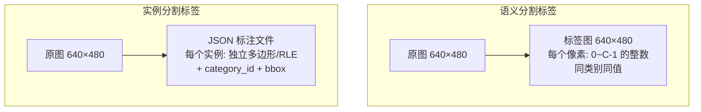

**数据增强的特殊考虑**

分割任务的数据增强比分类/检测更复杂——对图像的任何几何变换（旋转、翻转、缩放、裁剪）都必须**同步应用**到标签上。如果图像被水平翻转了，标签图也必须跟着翻转；如果图像被裁剪了，裁剪区域外的标注多边形也需要被截断。

## 7.3 FCN：分割领域的开山之作

### 7.3.1 从分类网络到全卷积网络

在 FCN（Fully Convolutional Networks）出现之前，人们用卷积神经网络做分割的思路很"笨拙"——以每个像素为中心，取一个固定大小的图像块（patch），扔进分类网络判断这个像素属于哪个类别。这个做法有两个致命缺陷：

1. **计算量巨大**：一张 224×224 的图像有 5 万多个像素，每个像素都要跑一次 CNN，计算量不可接受
2. **感受野受限**：每个像素只看它周围那一小块区域，缺乏全局上下文信息

FCN 的核心思想非常优雅——**把传统 CNN 最后的全连接层全部替换成 $1\times1$ 卷积层**。为什么这个替换如此关键？

传统分类 CNN 末尾的全连接层做了一件"暴力"的事：它把 $H \times W \times C$ 的三维特征图硬拍平成一个一维向量。在这个过程中，**空间信息被彻底丢弃了**——全连接层不知道某个特征原本在图像的左上角还是右下角。

替换成卷积层后，空间结构得以完整保留。网络的输出不再是一个标量类别分数，而是一张 $H' \times W' \times C$ 的分类特征图——每个空间位置对应一个 $C$ 类的分类结果。这为逐像素预测铺平了道路。

> FCN 的"卷积化"不仅是换几个层，而是彻底改变了网络的输出语义——从"整张图属于哪个类"变成"图上每个位置属于哪个类"。

> FCN 将端到端的语义分割变成了现实——输入一张图片，直接输出一张标记好的分割图，不需要任何 patch-by-patch 的滑窗操作。

### 7.3.2 FCN 的架构设计

FCN 的架构可以分为三个阶段：

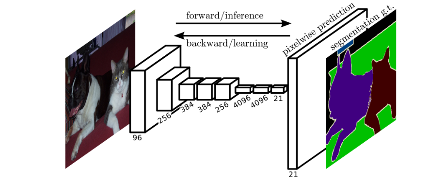

**第一步：用预训练分类网络做编码器**

FCN 的编码器通常采用 VGG-16 等在 ImageNet 上预训练好的分类网络。这些网络已经学会了提取丰富的视觉特征（边缘、纹理、形状、语义等），可以无缝迁移到分割任务中。

**第二步：全连接层卷积化**

传统 VGG-16 最后有两个 4096 维的全连接层和一个 1000 维的分类头。FCN 将这三层分别替换为卷积核大小为 $7 \times 7$、$1 \times 1$、$1 \times 1$ 的卷积层。这样网络的输出就不再是一个 1000 维的向量，而是一个 $H' \times W' \times C$ 的特征图。

其中 $C$ 是分割的类别数（包含背景）。比如 PASCAL VOC 数据集有 20 个前景类 + 1 个背景类 = 21 类，那么最终输出就是 $H' \times W' \times 21$ 的张量。

**第三步：上采样恢复分辨率**

经过 5 次 max pooling，特征图的分辨率变成了原图的 $1/32$（如果原图是 $224 \times 224$，特征图就只有 $7 \times 7$）。要把这张粗糙的分类图恢复到原图尺寸，需要上采样（Upsampling）。

FCN 使用转置卷积（Transposed Convolution，也叫反卷积 Deconvolution）来实现上采样。转置卷积可以看作卷积的"逆向"运算——从低分辨率特征图恢复到高分辨率输出。

### 7.3.3 跳跃连接与多尺度融合

如果直接把 $7 \times 7$ 的粗糙特征图一下子放大 32 倍，得到的结果会非常模糊——边界细节在层层下采样中已经丢失了。

FCN 用**跳跃连接（Skip Connection）**解决这个问题：将浅层的精细特征和深层的语义特征融合在一起。

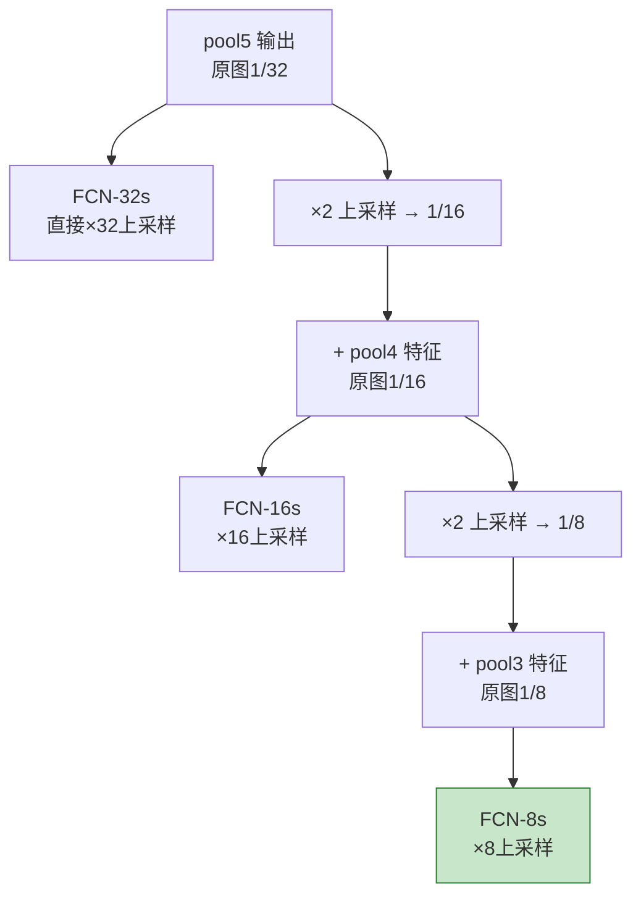

- **FCN-32s**：直接从 pool5（$1/32$ 分辨率）一步上采样 32 倍回到原图尺寸。速度快，但结果粗糙
- **FCN-16s**：先把 pool5 上采样 2 倍，和 pool4 的输出相加，然后再上采样 16 倍。融合了更精细的特征，效果明显提升
- **FCN-8s**：进一步融合 pool3 的特征，上采样 8 倍。精度最高，也是 FCN 论文中推荐使用的版本

> 浅层特征知道"边缘在哪里"，深层特征知道"这是什么"。跳跃连接把两者结合在一起——在正确的边界位置标注出正确的语义类别。

FCN 在当时（2015 年）取得了 PASCAL VOC 分割任务的 SOTA 成绩，mIoU 达到 62.2%（FCN-8s），相较于此前最好的方法提升了约 20%。更重要的是，它开创了端到端语义分割的范式，后来的 U-Net、DeepLab、PSPNet 等经典分割网络都是在 FCN 的基础思想上发展而来的。

## 7.4 U-Net：医学影像分割的基石

### 7.4.1 为什么需要 U-Net？

FCN 解决了分割的基本架构问题，但它有一个明显的局限：上采样过程比较"粗放"，虽然在最后融合了部分浅层特征，但深层到浅层之间的信息传递不充分。这在一般场景中尚可接受，但在医学影像这样对分割精度要求极高的场景下就不够了。

U-Net 就是为了解决这个问题而提出的。它在 2015 年的 ISBI 细胞追踪挑战赛上一举夺魁，此后迅速成为医学影像分割乃至整个语义分割领域的事实标准。

> U-Net 最核心的设计哲学：浅层特征的细节信息在下采样过程中被"丢失"了，光靠上采样找不回来——需要在对应层级之间建立直接的信息传递通道。

### 7.4.2 U-Net 的对称结构

U-Net 的网络结构因形状酷似字母 "U" 而得名，由左右两个对称的部分组成。下图是 U-Net 的经典结构——注意观察左侧的逐层下采样路径和右侧的逐层上采样路径，以及横跨左右的灰色箭头（跳跃连接），它们构成了 U-Net 最核心的信息传递通道：

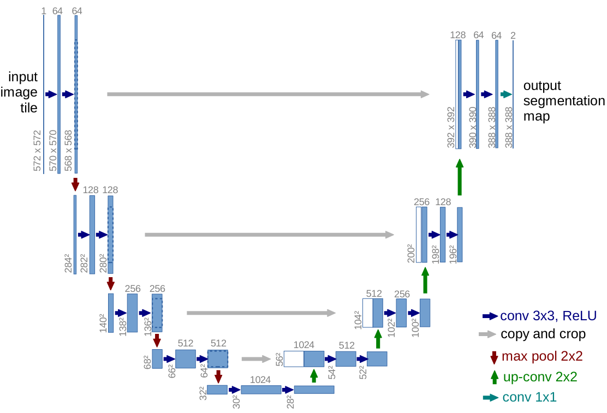

**编码器（左半部分）**由四个重复的模块组成，每个模块包含两个 $3 \times 3$ 卷积层（每个卷积后跟 ReLU 激活），然后是一个 $2 \times 2$ 的 max pooling 进行 $2$ 倍下采样。经过四次下采样后，特征图的尺寸变为原图的 $1/16$。

编码器每往下一层，特征图的空间分辨率减半，通道数翻倍。这个设计很自然——空间信息在压缩，但它并不是被丢弃，而是被"浓缩"到了更多的通道中。每个通道代表一种特征模式，越深的层级通道越多，意味着它能表达越丰富的语义概念。

**解码器（右半部分）**同样由四个模块组成，每个模块先从下层的特征图上采样 $2$ 倍，然后与编码器**对应层级**的特征图在通道维度上拼接（Concat），最后经过两个 $3 \times 3$ 卷积。

这里有一个至关重要的细节——**Concat，不是 Add**。Add 是逐元素相加，不增加通道数，相当于让两个特征图在同一套"坐标系"里融合；Concat 是堆叠，保留了各自的通道，让后续的卷积层自己学习如何组合这两套特征。对于需要精确位置信息的任务来说，Concat 能保留更多原始信息。

> 池化操作在提取高层语义的同时丢失了边缘等细节特征，上采样无法凭空"找回"这些被丢失的细节。U-Net 的跳跃连接就是把这些丢失的细节直接"抄近道"传送到解码器——深层特征告诉你"是什么"，浅层特征告诉你"边界在哪"。

### 7.4.3 U-Net 与 FCN 的关键区别

| | FCN | U-Net |
|:---|:---|:---|
| 上采样方式 | 转置卷积一次性放大 | 逐层上采样，逐步恢复 |
| 特征融合 | 逐元素相加（Add） | 通道拼接（Concat） |
| 跳跃连接 | 三层特征融合（pool3/4/5） | 每一层都有跳跃连接 |
| 参数量 | 较小 | 较大但对称优美 |
| 适用场景 | 一般语义分割 | 对精度要求极高的分割（医学影像等） |

U-Net 的对称跳跃连接设计使得网络在每一层都能融合对应分辨率的浅层细节——而不是像 FCN 那样只融合了 pool3/pool4 的几层。这也解释了为什么 U-Net 的分割边界通常比 FCN 更精细。

> U-Net 的诞生源于医学影像——细胞追踪、肿瘤分割、血管提取，这些任务对边界的像素级精度要求极高。但它对称优美的编码器-解码器结构很快被证明适用于几乎所有需要"图像→图像"映射的任务：卫星图语义分割、图像去噪、甚至扩散模型的噪声预测。U-Net 是深度学习领域少有的"能用 30 年不过时"的架构。

### 7.4.4 U-Net 的训练技巧

**输入尺寸处理**：原始 U-Net 使用了无 padding 的 $3 \times 3$ 卷积，每次卷积会导致特征图缩小 2 像素。因此最终输出比输入小（输入 $572 \times 572$，输出 $388 \times 388$）。在实际工程中，现在已经普遍使用 padding 卷积以避免尺寸变化。

**数据增强**：医学影像数据通常很稀缺，U-Net 论文中使用了 elastic deformation（弹性形变）作为数据增强手段，这在细胞影像中尤其有效——细胞本身就有弹性，这种增强贴合实际情况。

**加权损失**：对于细胞分割任务，细胞之间的边界区域是分割难点。U-Net 使用了一种预计算的权重图，让网络更关注细胞之间的"缝隙"——这些区域稍有不慎就会把相邻细胞连成一团。

## 7.5 Mask R-CNN：实例分割的标杆

### 7.5.1 从目标检测到实例分割

到目前为止，我们讲的 FCN 和 U-Net 都在解决**语义分割**问题——每个像素属于哪个类别。但在真实场景中，"画面里有三只猫"和"这三只猫各自的轮廓是什么"是两个不同的问题。前者是语义分割，后者是**实例分割**。

Mask R-CNN 用一个巧妙的方式完成了这个跨越：它把目标检测中成熟的"找出每个目标"能力，与 FCN 中"逐像素标注轮廓"的能力结合在一起。具体来说——

Mask R-CNN 是实例分割领域最经典也最实用的方法之一。它的核心思路简单到令人惊讶：**在 Faster R-CNN 的基础上加一个 FCN 分支用于预测 Mask**。

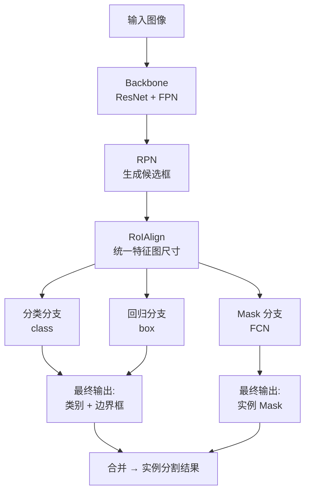

> Mask R-CNN = Faster R-CNN + FCN，就是这么简单。但这个简单的加法却实现了实例分割领域的 SOTA 效果，这要归功于几个关键的设计细节。

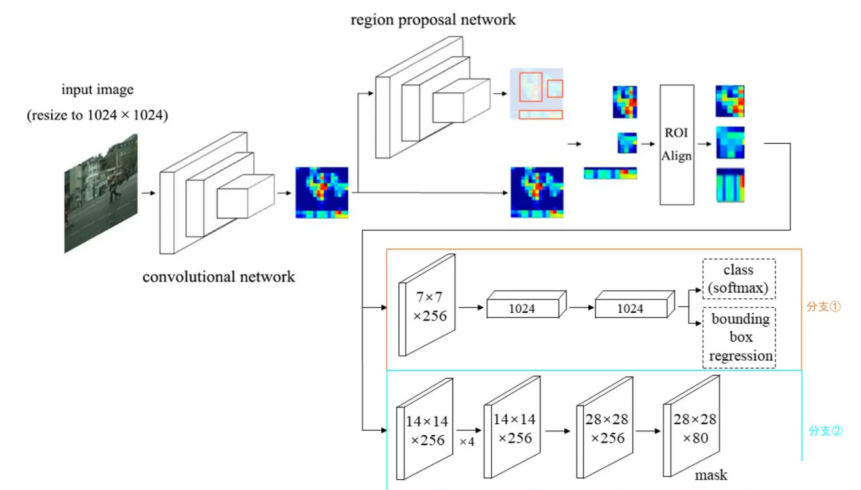

Mask R-CNN 的灵活性极高——可以在同一个框架下完成目标分类、目标检测、语义分割、实例分割、人体关键点检测等多种任务，只需增加或调整相应的预测分支即可。

### 7.5.2 Mask R-CNN 的工作流程

了解了整体架构后，我们按照一次前向传播的执行顺序，逐步拆解 Mask R-CNN 的完整流程。下图展示了一张输入图像经过各模块到最终输出分割结果的全过程：

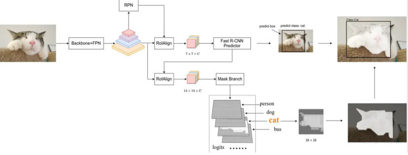

**第 1 步：特征提取**

输入图像经过 Backbone 网络（通常是 ResNet + FPN）提取特征。FPN（特征金字塔网络）能提供多尺度的特征图，对检测不同大小的目标很有帮助。

**第 2 步：候选框生成（RPN）**

特征图送入 RPN（Region Proposal Network），在每个位置生成多个不同尺度和宽高比的 Anchor，然后对这些 Anchor 进行二分类（前景/背景）和初步的位置回归，保留下最可能包含目标的候选框。

**第 3 步：RoIAlign**

这是 Mask R-CNN 最重要的改进之一。RPN 输出的候选框大小不一，需要统一到相同的尺寸才能送入后续的全连接层或 Mask 分支。

Faster R-CNN 使用的是 RoIPool——将候选框区域均匀划分，对每个子区域做 max pooling。但 RoIPool 存在两次**量化取整**操作：

- 第一次：候选框的浮点坐标映射到特征图时需要取整
- 第二次：候选框区域被等分成固定大小的子区域时，边界又需要取整

这两次量化会导致预测的 Mask 和原图对不齐——对检测任务影响较小（边界框偏几个像素无所谓），但对需要像素级精度的分割任务来说就是致命伤。

RoIAlign 完全不进行量化，而是使用**双线性插值**精确计算每个采样点的像素值：

1. 保留所有浮点坐标，不取整
2. 将候选框区域等分，在每个子区域均匀采样 4 个点
3. 每个采样点通过双线性插值从特征图中获得精确的像素值
4. 对每个子区域的 4 个采样点取 max 或 average

**第 4 步：多任务预测**

RoIAlign 输出的统一尺寸特征图会并行送入三个分支：

- **分类分支**：$N+1$ 类分类（$N$ 个前景类 + 1 个背景类）
- **回归分支**：对候选框位置进行精确微调，输出类别相关的边界框偏移
- **Mask 分支**：一个小的 FCN，对每个候选框生成 $28 \times 28$ 的 mask

### 7.5.3 Mask 分支与"解耦"设计

Mask 分支是 Mask R-CNN 的点睛之笔。它本质上就是一个小的 FCN——经过几层卷积和转置卷积后，输出一个 $28 \times 28 \times N_{cls}$ 的特征图（$N_{cls}$ 是类别数）。

这里有一个非常关键的设计选择——**"解耦"（decouple）**。传统的 FCN 对每个像素的每个类别都预测分数，然后通过 softmax 决定该像素属于哪个类别。但 softmax 会让不同类别之间产生竞争——一个像素被预测为"猫"的概率高，意味着被预测为"狗"的概率被压制。

Mask R-CNN 认为这种竞争不利于分割精度。既然分类分支已经告诉了我们候选框里是什么类别（比如"猫"），那 mask 分支就不需要再做一遍类别比较了——直接从 $28 \times 28 \times N_{cls}$ 的输出中提取对应该类别的那个通道（单通道 $28 \times 28$），然后二值化就好了。

> 分类和分割"解耦"：分类分支负责判断"这是什么"，Mask 分支只负责"这个目标的轮廓在哪"。各司其职，互不干扰。

具体做法是：Mask 分支的输出经过 sigmoid（而不是 softmax），每个类别的 mask 是独立预测的。然后用分类分支预测的类别去"选择"对应通道的 mask，这样就完全消除了类别间的竞争。论文实验表明，这种解耦设计比传统的 softmax 方式提升了约 1 个点的 AP。

### 7.5.4 Mask R-CNN 的损失函数

Mask R-CNN 的总损失由三部分组成：

$$L_{total} = L_{rpn} + L_{fast\_rcnn} + L_{mask}$$

$L_{rpn}$ 和 $L_{fast\_rcnn}$ 与 Faster R-CNN 完全相同，这里不再赘述。我们重点看 $L_{mask}$。

$L_{mask}$ 本质上就是**逐像素的二分类交叉熵**。但它有一个精妙的设计：

- Mask 分支为每个候选框输出 $N_{cls}$ 个 $28 \times 28$ 的二值 mask
- 在计算损失时，**只计算 GT 类别对应通道的 mask 损失**
- 其他通道（非 GT 类别）的 mask 完全不参与损失计算

这意味着 mask 分支不需要学习"区分哪个类别有哪些像素"——这个任务已经被分类分支完成了。mask 分支只需要学习"这个类别的目标，像素分布是什么样的"。

在训练阶段，输入 RoIAlign 的候选框来自 RPN 而非最终的 Fast R-CNN 分类/回归头。这个设计其实起到了数据增强的效果——RPN 产生的候选框不够精确，一个目标周围会有多个略有偏移的候选框（类似随机裁剪），这相当于增加了训练样本的多样性。

在推理阶段，候选框则来自经过分类和回归精修后的 Fast R-CNN 输出——此时只需要最准确的框。

### 7.5.5 Mask R-CNN 的 Backbone 选择

Mask R-CNN 论文给出了两种骨干网络配置：

| 配置 | Backbone | 特点 |
|:---|:---|:---|
| 结构 1 | ResNet / ResNeXt（无 FPN） | 分类、回归、Mask 分支共用一个 RoI 层 |
| 结构 2 | ResNet / ResNeXt + FPN | Mask 分支有独立的 RoIAlign 层，保留更高分辨率特征 |

使用 FPN 的结构 2 效果更好，因为 FPN 提供了多尺度特征——浅层高分辨率特征有助于 Mask 分支生成更精细的轮廓，深层低分辨率特征有助于分类和回归的准确性。当前业界使用 Mask R-CNN 基本都采用结构 2。

### 7.5.6 推理阶段的完整流程

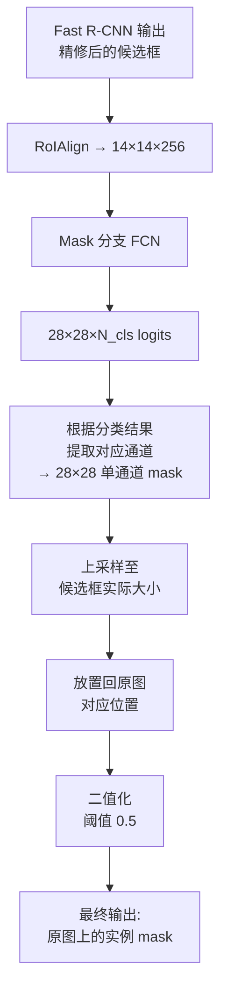

在推理时，Mask 分支接收 Fast R-CNN 输出的精确候选框，生成每个实例的 mask。最终的 mask 经过阈值 0.5 二值化，大于 0.5 的像素设为前景（该实例的一部分），小于等于 0.5 的设为背景。这样就得到了每个实例在原图上的精确像素级分割。

## 7.6 YOLOv11 实例分割

### 7.6.1 YOLOv11 与前代 YOLO 的分割演进

回顾第 6 章中详细讲过的 YOLO 检测系列，YOLOv5 在 2022 年首次将实例分割引入了 YOLO 家族。它的实现方式是：在检测头旁边增加一个并行的 Proto 网络（即 Proto Head 的前身），为全图生成一组 mask prototypes，然后每个检测框预测一组线性系数来组装自己的 mask。

然而 YOLOv5 的检测头当时仍是"耦合"的——分类和回归共享同一个卷积分支。YOLOv8（2023）对此做了重要改进：将检测头改为解耦头（Decoupled Head），分类、回归各走各的卷积分支，并新增了独立的 mask coefficient 分支。同时，YOLOv8 将 Backbone 中的 C3 模块升级为 C2f 模块，提升了特征提取效率。

**YOLOv11**（2024）在此基础上完成了关键性的架构跃升——**C3k2 模块替代 C2f、改进的 FPN+PAN 特征融合、更精简高效的分割头**，使得分割精度（mAP）和推理速度同时获得了显著提升。C3k2 的核心变化在于允许配置更小的卷积核尺寸（k 参数），从而在保持感受野覆盖的前提下减少参数量和计算量——这对分割任务尤为关键：更轻量的 Backbone 意味着可以把更多算力留给高分辨率的 Proto Head。

> YOLOv11 的分割并不是"检测完了再分割"的两阶段思路，而是像 Mask R-CNN 一样在单次前向传播中同时输出检测框和分割 mask。但不同于 Mask R-CNN 的 RoIAlign + 小 FCN 方案，YOLOv11 利用了 Prototype Mask 的生成机制，计算效率更高。

### 7.6.2 YOLOv11 分割架构深度解析

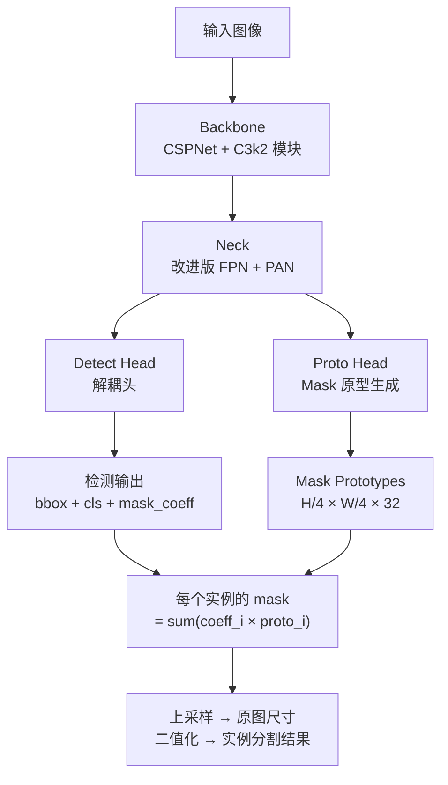

YOLOv11 的实例分割之所以高效且通俗易懂，核心在于它抛弃了“为每个目标单独画掩码”的笨办法，转而采用了一种 **“全局模板 + 动态组装”** 的策略。

### 7.6.3 核心思想：模板组装策略

传统的分割方法（如 Mask R-CNN）像是给每个检测到的物体单独请一个画师去描绘轮廓，计算量随目标数量线性增加。 而 YOLOv11 的做法是：

- **Proto Head（原型头）**：提前准备好 **32 张通用的“形状模板”**（Prototype Masks）。这些模板是网络自己学出来的基础笔画（比如边缘、圆弧、角点等），全图共享，只生成一次。
- **Detect Head（检测头）**：对于每个检测到的物体，不直接输出像素级的 Mask，而是输出 **32 个系数（Mask Coefficients）**。这相当于告诉系统：“用第1号模板的30% + 第5号模板的80% + ... 拼出这个物体的形状”。

> **通俗类比**： Proto Head 就像是一个拥有32种基础形状的**印章盒**。 Detect Head 就像是**配方师**。 最终 Mask = 按照配方师的指令，把对应的印章盖在纸上并叠加起来。无论画面中有1个物体还是100个物体，印章盒只需要准备一次。

### 7.6.4 关键组件深度拆解

#### Proto Head：制造“通用模具”

这是分割的基石。它通常挂载在 Neck 的高分辨率特征层（$P_3$）上。

- **输入**：来自 Neck 的高分辨率特征图（$P_3$ 层，分辨率 $H/8 \times W/8$），因为浅层特征保留了更多空间细节。
- **处理**：首先通过一次 $2\times$ 上采样将分辨率提升到 $H/4 \times W/4$，再经过 3 个 $3\times3$ 卷积 + ReLU，将语义信息转化为空间结构信息。
- **输出**：一个尺寸为 `H/4 × W/4 × 32` 的特征张量——32 张"软 mask"，每张图的值在 0 到 1 之间连续分布，表示该位置属于某种形状模式的程度。

  - **为什么是 H/4？** 这是精度与计算量的平衡点。原图分辨率（H×W）太大算不动，H/8 对大目标够用但对小目标丢失细节过多。H/4 在每个维度只比原图稀疏 4 倍，足够保留轮廓精度，同时计算量可控。
  - **为什么是 32 通道？** 这是一个经验设计。32 个基向量足以线性组合出 COCO 等数据集中绝大多数物体的轮廓复杂度——人、车、动物、家具的轮廓差异再大，也能用 32 种基础形状的叠加来逼近。少于 16 个表达能力不足，多于 64 个则冗余且训练不稳定。

#### Detect Head：输出”组装配方”

在原有的分类（cls）和回归（box）分支旁，新增了一个 **mask coefficient 分支**。

- **输出维度**：N×32（N为候选框数量）。
- **物理含义**：这 32 个浮点数就是线性组合的权重 αi。它们决定了每个 Prototype Mask 对当前实例的贡献度。
- **解耦优势**：因为 Mask 的生成被解耦为“全局模板”和“局部系数”，检测头可以专注于定位和分类，不需要背负沉重的像素级预测负担。

#### Mask Assembly：毫秒级合成

这是推理阶段最精妙的一步。每个实例的最终 mask 通过一次线性组合完成：

$$M_k = \sigma\left(\sum_{i=1}^{32} \alpha_{k,i} \cdot P_i\right)$$

其中 $P_i$ 是 Proto Head 输出的第 $i$ 张 Prototype Mask（尺寸 $H/4 \times W/4$），$\alpha_{k,i}$ 是 Detect Head 为第 $k$ 个实例预测的第 $i$ 个系数，$\sigma$ 是 sigmoid 函数。这 32 个系数本质上就是"组装说明书"。

这个设计有三个核心优势：

- **并行计算**：所有实例的 mask 可以通过矩阵乘法 $A_{N \times 32} \times P_{32 \times HW}$ 一次性批量生成，不需要 for 循环逐实例处理。
- **Sigmoid 激活**：将线性组合结果映射到 $[0, 1]$ 概率区间，表示每个像素属于该实例前景的概率。
- **后处理链**：上采样至原图尺寸 → 阈值 0.5 二值化 → 裁剪到 BBox 范围内（去除 mask 可能溢出边界框的部分）。

### 7.6.5 YOLOv11 分割 vs Mask R-CNN

将 YOLOv11 的分割方案和 Mask R-CNN 放在一起对比，能更好地理解单阶段和两阶段方案在设计哲学上的根本差异：

| 维度 | Mask R-CNN | YOLOv11 分割 |
|:---|:---|:---|
| 整体范式 | Two-Stage（RPN → RoIAlign → FCN） | One-Stage（端到端单次推理） |
| Mask 生成方式 | 每个 RoI 独立跑一个小 FCN | 全图共享 Prototype Mask + 系数组合 |
| 输入 mask 分支的特征 | RoIAlign 裁剪后的 14×14 特征 | 全图级别高分辨率特征（H/4 × W/4） |
| 推理速度 | 较慢（每个 RoI 都要跑 FCN） | 快（全图只跑一次 Proto Head） |
| 小目标精度 | 较高（FPN + 独立 RoIAlign） | 依赖高分辨率 Proto 特征 |
| 灵活性 | 极高（可加任意分支：关键点、姿态等） | 中等（以检测为主要目标的统一框架） |

从表中可以看出，Mask R-CNN 更偏向"精工出细活"——每个候选区域都得到独立处理，代价是速度；YOLOv11 更偏向"批量流水线"——全图共享的模板一次生成，所有实例的 mask 一次矩阵乘法批量产出。

> YOLOv11 的分割哲学是"模板组装"——让网络学习 32 个万能模板，每个实例只需指明各用多少比例。Mask R-CNN 的分割哲学是"每个实例独立绘制"——为每个候选区域单独跑一遍 FCN。前者快，后者精。

### 7.6.6 分割损失函数

YOLOv11 的分割损失由两部分组成：

$$L_{seg} = L_{det} + \lambda \cdot L_{mask}$$

$L_{det}$ 是标准的检测损失（和 YOLOv11 检测任务完全相同），包括分类损失 $L_{cls}$ 和边界框回归损失 $L_{box}$（CIoU + DFL）。

$L_{mask}$ 是二分类交叉熵——将每个实例的合成 mask 与该实例的 GT mask 做逐像素的二分类交叉熵。注意这里只对正样本（实际匹配到目标的预测框）计算 mask 损失，负样本的 mask 系数不参与损失计算。

$\lambda$ 是分割损失的权重，通常在 0.5 到 1.0 之间。这个权重的设计平衡了"检测质量"和"分割质量"——太小会让模型忽视分割质量，太大会拖累检测分支的训练。

### 7.6.7 为什么 YOLO 系列的分割越来越重要？

回到实际工程视角，YOLOv11 分割方案最大的优势是**部署友好**：

1. **统一框架**：检测 + 分割共享同一个 Backbone 和 Neck，不需要额外的独立分割网络
2. **实时性能**：Proto Head 只增加约 10-15% 的计算开销，即可在检测的同时获得分割结果
3. **工程成熟**：YOLO 生态（Ultralytics）提供了完整的训练、导出（ONNX/TensorRT/NCNN）、部署工具链
4. **端到端优化**：不需要像 Mask R-CNN 那样的多步后处理，检测和分割结果在一次推理中全部产出

这使得 YOLO 分割方案在工业界的采用率快速增长——从自动驾驶（道路标线、可行驶区域）、工业质检（缺陷精确定位），到农业（作物计数、病虫害面积估计），"边检测边分割"正在成为一种标配能力。

## 本章小结

图像分割是计算机视觉中的核心任务，从"像素级分类"的角度为每个像素赋予语义标签。本章从最基础的概念出发，逐步深入到经典算法和现代方案：

1. **分割任务分类**：语义分割（像素分类，不区分个体）、实例分割（区分同类别不同个体）、全景分割（统一两者）
2. **损失函数设计**：从逐像素交叉熵（平等对待所有像素）到加权交叉熵（按类别频率加权），再到 Focal Loss（关注难样本）和 Dice Loss（直接优化重叠度），逐步解决类别不均衡问题
3. **数据集与标注格式**：COCO JSON（多边形 + RLE）与 VOC PNG（像素级颜色标注）两种主流格式，分别服务于实例分割和语义分割
4. **FCN**：开创端到端语义分割的范式——用卷积层替代全连接层，通过跳跃连接融合多尺度特征，将深度语义与浅层细节结合
5. **U-Net**：对称的编码器-解码器结构，通过通道拼接（Concat）的跳跃连接在每一层恢复精细的空间信息，成为医学影像分割的标准方案
6. **Mask R-CNN**：在 Faster R-CNN 基础上增加 FCN 分支实现实例分割，通过 RoIAlign 消除量化误差、解耦设计消除类别竞争，奠定了实例分割领域的标杆地位
7. **YOLOv11 分割**：基于 Prototype Mask + 系数组合的 One-Stage 方案，32 个通用模板全图共享，每个实例只需 32 个标量系数即可合成 mask——在实时性和分割精度之间取得了出色的平衡

图像分割方法还在持续演进——从 CNN 时代到 Vision Transformer（如 SAM、Mask2Former 等将在第 11 章讨论），分割的精度和泛化能力仍在不断提升。但理解本章这些经典方法的设计思想，是深入这个领域的必经之路。
